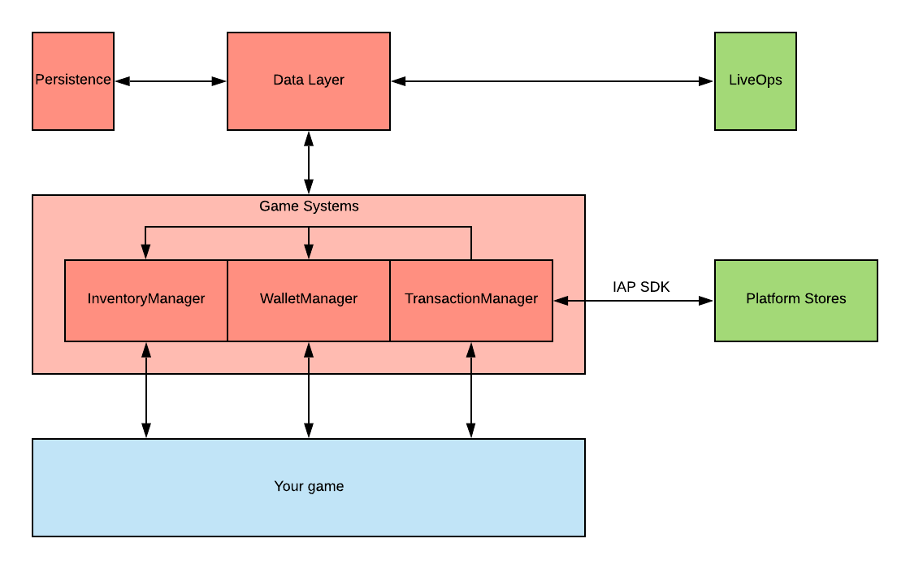

# Architecture

- Game Foundation is divided into various systems, each with managers referenced from the static class [GameFoundationSdk].  Once you have set up all your [Catalogs] in the Unity Editor, and initialized Game Foundation in your application, you will be ready to start using the Game Foundation package to facilitate [In App Purchases], implement your [Game Economy] and utilize the many features that Game Foundation supports.

## General purpose

- The [Inventory Manager] helps you create new objects and get access to their static data (basically the configuration of your game).
- The [Wallet Manager] simplifies the management of your currencies
- The [Transaction Manager] is a turn-key solution for both virtual and real money purchases, being a simple interface for a critical process for your game to be successful.

Those systems talk to each other:

- When the [Transaction Manager] processes a transaction ([Virtual] or [IAP]) it requires the [Inventory Manager] and the [Wallet Manager] to consume the costs and to generate the rewards.

## Persistence and LiveOps

We've introduced the [Data Layer] to synchronize and persist the Game Foundation data.
It is an interface the Game Systems talk to in order to synchronize the mutations of their data with external components.

These components can be as simple as a local persistence system:

- Use the [Persistence Data Layer] for a file-based turn-key solution
- Use the [Memory Data Layer] for a customizable solution.

But the solution can be a lot more powerful if you decide to use a Data Layer implementation connected to some backend services.
Cloud save, but also server authoritative transactions, A/B Testing and segmentation are then easy to use, as the Game Foundation Core API doesn't change if you decide to switch from local persistence to cloud persistence.

[GameFoundationSdk]: GameFoundationSdk.md

[Catalogs]: GameSystems.md

[in app purchases]: CatalogItems/IAPTransaction.md

[game economy]: GameSystems/GameEconomy.md

[inventory manager]: GameSystems/InventoryManager.md

[wallet manager]: GameSystems/WalletManager.md

[transaction manager]: GameSystems/TransactionManager.md

[virtual]: CatalogItems/VirtualTransaction.md

[iap]: CatalogItems/IAPTransaction.md

[data layer]: DataLayers.md

[persistence data layer]: DataLayers.md#persistence-data-layer

[memory data layer]: DataLayers.md#memory-data-layer
