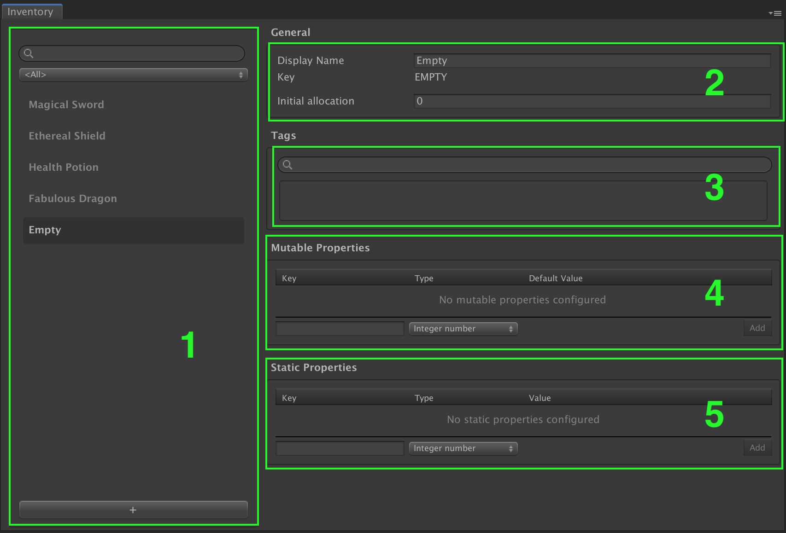

# Game Foundation Catalog

## Overview

__Game Foundation Catalog__ contains all the static data.
This data is grouped into different catalogs, each of them dealing with a kind of [catalog item].

A default catalog is created automatically when you open one of the Game Foundation windows, but you can also create your own using __Assets → Create → Game Foundation → Catalog__.

## Catalog Items

__Catalog Items__ are where data about the items are defined.
They are stored in their respective Game Foundation catalogs.
Once your __Game Foundation Catalog__ has been actualized, constants for all items in catalog can be generated by selecting the Catalog in the Unity `Project` window, then clicking the `[Generate Constants]` button in the Unity `Inspector` window.

The current version of Game Foundation provides the following catalog item types:

- [Inventory Item Definition] - Items owned by the player such as a sword, potion, bag of apples, etc.  Items can also maintain properties (please see Tutorials [06](Tutorials/06-StaticProperties.md), [07](Tutorials/07-MutablePropertiesEditor.md) and [08](Tutorials/08-MutablePropertiesRuntime.md) for more info and examples), to make each item unique as needed (i.e. _Red_ Apple, _50% full_ Potion, etc.).
- [Currency] - As above, but only includes a count of currency, not individual items so no properties can be applied.  However currencies are very useful as coins, gems, etc. where quantities need to be modified quickly at runtime, such as in an endless runner where coins are gathered at a rate of several per second.
- [Reward] - Describes exactly what reward(s) a player will receive from the [Reward Manager](GameSystems/RewardManager.md) whenever a specific reward is to be granted.  Rewards can include Inventory Items and/or Currencies, as desired.
- [Virtual Transaction] - Manages the exchange of specific in-game items and/or currencies for other items and/or currencies.  Game play can decide when a transaction is executed and the appropriate costs are consumed and payouts received.  Virtual transactions can be extremely useful for a crafting system, for example, or to use currency to purchase items.  Virtual transactions are the heart of your [Game Economy](GameSystems/GameEconomy.md).
- [IAP Transaction] - In-App-Purchase Transactions permit players to exchange real-world money for your in-game Inventory Items and/or Currencies using payouts described for each transaction.
- [Store] - Each store maintains a list of available transactions (IAP, Virtual or both) that are returned when the store is queried.
- [Tags] - Tags can be added to most [Catalog Items](Catalog.md) to permit filtering in the Game Foundation Editor windows as well as through scripts.
- [Game Parameters]- Game Parameters provide static configuration for your game that can be accessed through script.  These parameters can control your [Game Economy](GameSystems/GameEconomy.md), enable Sales and Promotions, etc.

__Catalog Items__ can be assigned [tags] and properties.

## Editor Overview

Each catalog shares the same editor layout.

(1) All catalog's items are listed on the left.
  Use the `+` button at the bottom to create a new one.

(2) The General section allows you to edit the Display Name of the item definition.
  The key is read-only. It can be set only at creation time.

(3) The [Tags] section is a widget which provides an intuitive way to assign [tags] to the edited item.  
  Start typing your tag, then select the proper one in the dynamically created list, or create a new one.

(4) Here are the sections specific to the type of edited catalog item. 

(5) In the **Static Properties** section you can define a list of fields for the catalog item to read at runtime.\
  A static property must define:
  - A value type. Supported types are `integer number` (e.g. int & long), `real number` (e.g. float & double), `bool`, `string` and `resources asset` (e.g. any asset stored in a Resources folder).
  - A unique key for you to access the property at runtime.
  - A value.

  Static Properties belong only to the definition they are declared into.
  This means you can use the same property key in different definitions with a different type if you want to.

[catalog item]:  #Catalog-Items
[catalog items]: #Catalog-Items

[inventory item definition]: CatalogItems/InventoryItemDefinition.md

[currency]: CatalogItems/Currency.md

[reward]: CatalogItems/RewardDefinition.md

[virtual transaction]: CatalogItems/VirtualTransaction.md

[iap transaction]: CatalogItems/IAPTransaction.md

[store]: CatalogItems/Store.md

[tags]: CatalogItems/Tag.md

[game parameters]: CatalogItems/GameParameters.md
