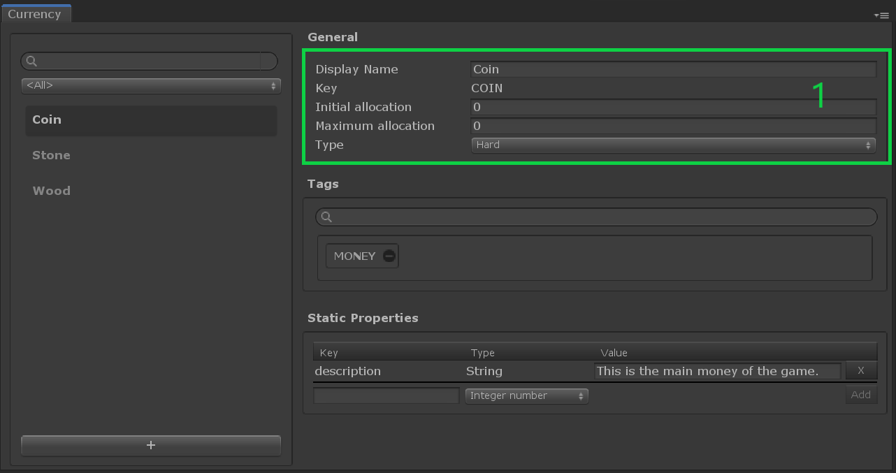

# Currency

## Overview

A __Currency__ is a [catalog item] dedicated to the [Wallet Management], which can help track the quantity of your in-game resources without the additional overhead of item instances, unlike [Inventory Items](InventoryItemDefinition.md). 

You may want to deal with a collectible resource, but don't need to identify each instance of the resource. A __Currency__ is the type of [catalog item] you need. 

While in-game money is the most common use case, there're other currency-like resources belonging to a player, such as energy, score, number of lifes / moves,that can also be defined as Currency. 

This type of item has 3 special fields:

- `Initial allocation`: the balance the player has when his/her profile is created.
- `Maximum allocation`: The maximum balance a player can have.
  `0` means no limit.
- `Type`: The type of the __currency__.

While in-game money is the most common use case, there're other currency-like resources belonging to a player, such as energy, score, number of lifes / moves,that can also be defined as Currency. 

## Currency Type

A __Currency__ can be soft, or hard.

Also called "regular currency" or "free currency", a __soft__ currency is a resource designed to be adequately accessible through normal gameplay, without having to make micro-transactions.

A __hard__ currency is a resource that is exclusively, or near exclusively acquired by paying for it (real-money transactions).
Also called "premium currency", it is much harder to acquire without making purchases, and thus is considered to be premium game content.

## Editor Overview

Open the __Currency window__ by going to __Window → Game Foundation → Currency__.
The Currency window will let you configure Currencies.

The interface is similar to the other [catalog items editor].

(1) In addition to the shared General section, you'll find the three special fields `Initial allocation`, `Maximum allocation,` and `Type`.

[catalog item]: ../Catalog.md#Catalog-Items

[catalog items editor]: ../Catalog.md#Editor-Overview

[wallet management]: ../GameSystems/WalletManager.md
