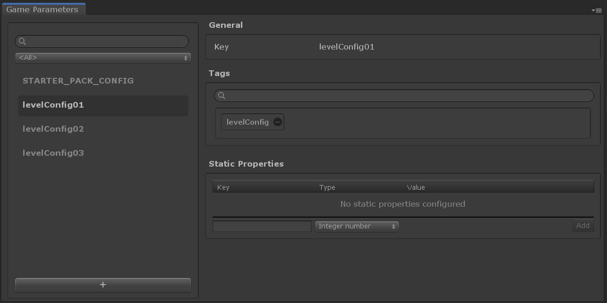

# Game Parameters

## Overview

__Game Parameters__ provide static configuration for your game that is accessible through script. These parameters can control various aspects of your game, including your [Game Economy](../GameSystems/GameEconomy.md). Each Game Parameter is a [catalog item] and works similar to other [catalog items], except they don't have a `display name`.  

You can create __Game Parameter__ objects, then define static properties to further define that concept.

## Editor Overview

Open the __Game Parameter window__ by going to __Window → Game Foundation → Game Parameters__.
The __Game Parameter__ window will let you configure game parameters.

In the example above, a __Game Parameter__ is created per game level. This game parameter can be an approach to set up the difficulty of the levels in a game, or toggle some features on or off according to difficulty of game level.

[catalog item]:  ../Catalog.md#Catalog-Items
[catalog items]: ../Catalog.md#Catalog-Items
