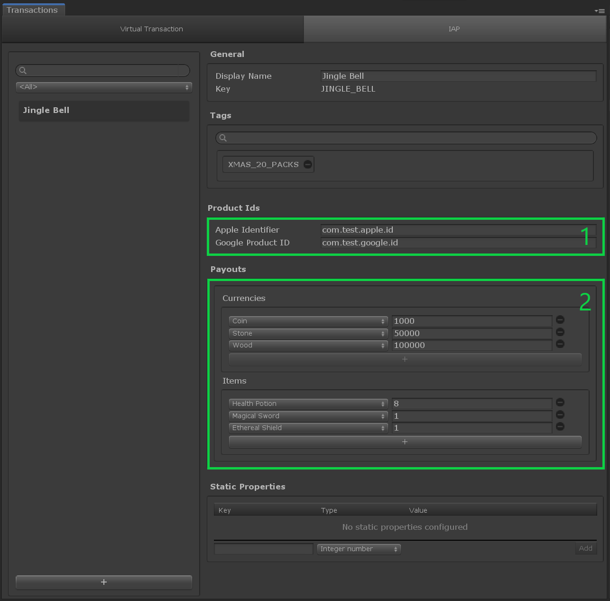

# IAP Transaction

## Overview

An __IAP Transaction__ permits players to exchange real-world money for in-game Inventory Items and/or Currencies using payouts described in each transaction.  Each IAP Transaction is a [catalog item] dedicated to In-App Purchasing.

This type of transaction shows 2 specifics fields:

- `Product Ids`: the identifiers of the products in the Platform Stores (Google Store and Apple App Store).
They are used by the IAP SDK through the [TransactionManager] to process the in-app purchase step.
- `Payouts`: it describes the outcome from the transaction, the list of items and currencies the player receives when processing this transaction.

## Editor Overview

Open the __Transaction__ window by going to __Window → Game Foundation → Transaction__.
The Transaction window will let you configure both [Virtual Transactions] and __IAP Transactions__).

The interface is similar to the other [catalog items editor].

(1) The Product IDs section allows the content creator to specify which product ids are linked to the transaction being edited.
  > **Tip:** Make sure to enter a product ID into both Apple and Google fields if you want to build for both platforms.

(2) The Payouts section shows a list of [currencies] and [item definitions].
  Those are the outcome of the transaction.
  The amounts next to each entry are the number of those items the player will get from the transaction.

[catalog item]:  ../Catalog.md#Catalog-Items
[catalog items]: ../Catalog.md#Catalog-Items

[catalog items editor]: ../Catalog.md#Editor-Overview

[transactionmanager]: ../GameSystems/TransactionManager.md

[virtual transactions]: VirtualTransaction.md

[currencies]: Currency.md

[item definitions]: InventoryItemDefinition.md
