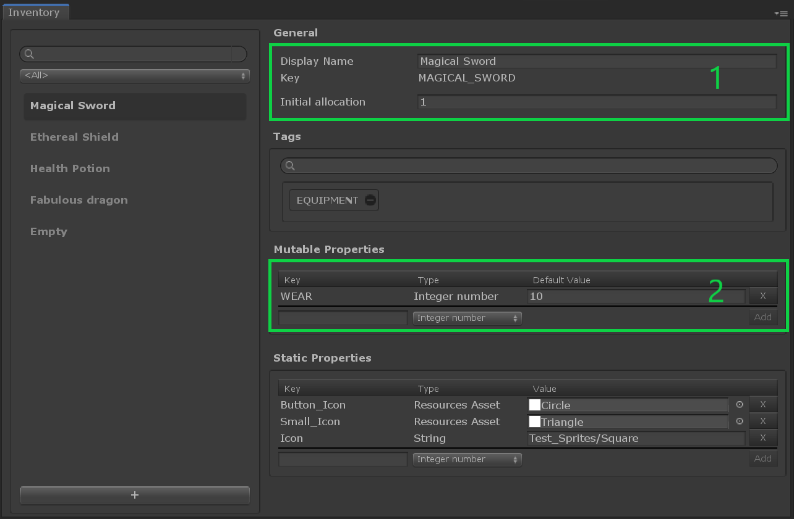

# Inventory Item Definition

## Overview

An __Inventory Item Definition__ represents a template for creating items owned by a player in the game. Items can also maintain properties (see Tutorials [06](../Tutorials/06-StaticProperties.md), [07](../Tutorials/07-MutablePropertiesEditor.md), and [08](../Tutorials/08-MutablePropertiesRuntime.md) for reference and examples).  Once the item definitions are created, you can use them to instantiate instances of __Inventory Items__ in your game.

## Editor Overview

Open the __Inventory window__ by going to __Window → Game Foundation → Inventory__.
The Inventory window will let you configure inventory item definitions.

The interface is similar to the other [catalog items editor].

(1) In addition to the shared General section, you have the `Initial allocation` field to determine how many items instances of this definition your player will have at the start of the game.

(2) In the **Mutable Properties** section you can define a list of fields for the item instances to read and write at runtime.\
  A mutable property must define:
  - A value type. Supported types are `integer number` (e.g. int & long), `real number` (e.g. float & double), `bool`, `string` and `resources asset` (e.g. any asset stored in a Resources folder).
  - A unique key for you to access the property at runtime.
  - A default value.

  Mutable Properties belong only to the definition they are declared into.
  This means you can use the same property key in different definitions with a different type if you want to.

[catalog item]: ../Catalog.md#Catalog-Items

[catalog items editor]: ../Catalog.md#Editor-Overview

[tags]: Tag.md
