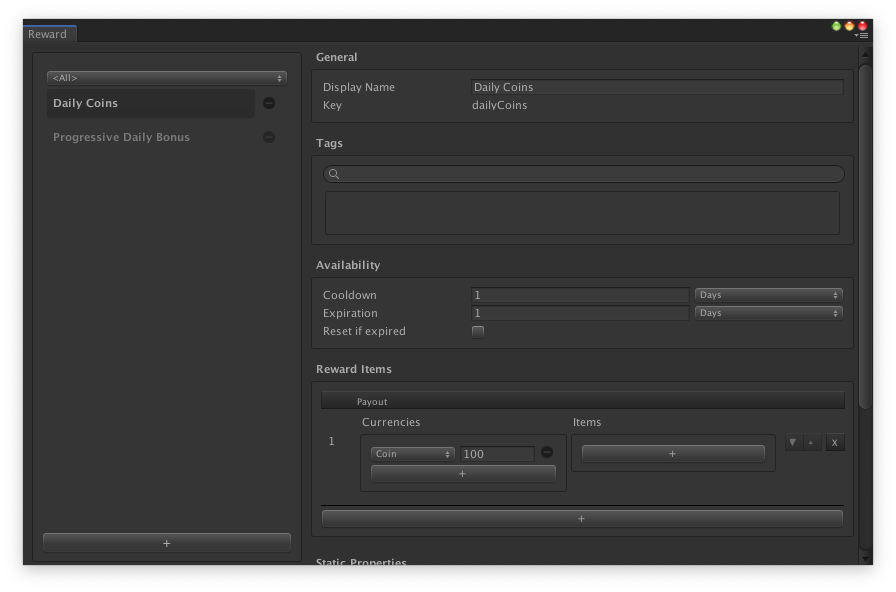

# Reward Definition

## Overview

A __Reward Definition__ describes what rewards a player will receive from the [Reward Manager](../GameSystems/RewardManager.md) whenever a specific reward is to be granted.  Rewards can include Inventory Items and/or Currencies, as desired.  Each Reward Definition is a [catalog item] used to give players an item or currency based on conditions that you define. If a player satisfies them, they're eligible to receive an in-game reward.

The conditions for a Reward Definition are defined in the __Reward__ window. To open the __Reward__ window, in your Unity project, go to __Window__ > __Game Foundation__ > __Reward__. Select a Reward Item from the __Reward__ window (for example, Daily Coins) to see all the possible fields to configure for a reward. 

The interface is similar to the other [catalog item editors] under the __Availability__ section of a selected Reward list item.

Here is a description of each __Availbility__ field:

- `Cooldown`: The amount of time a player needs to wait after claiming a Reward Item before they can claim the next Reward Item in the sequence.
- `Expiration`: The amount of time to claim a Reward Item before it becomes no longer available to the player. When a Reward Item is not claimed in time, it expires.
- `Reset if Expired`: Enabling this setting will cause the Reward sequence to restart when the latest valid Reward Item expires. The next valid Reward Item is the first one in the sequence. If this setting is not enabled, the next valid Reward Item will be the next one in the sequence, will not trigger a cooldown, and will immediately start a new expiration countdown.

To begin creating a Reward Definition, [follow the tutorial to create a simple daily reward or progressive daily reward].

## Reward Item Definitions

A Reward Definition also keeps an ordered collection of Reward Item Definitions. Each Reward Item Definition describes a payout. If the validaton conditions of the Reward Definition indicate that the Reward Item at a certain index in the collection is valid, then the player may claim that payout.

[Follow the tutorial to create a simple daily reward or progressive daily reward]: ../Tutorials/17-CreatingRewards.md

[catalog item]: ../Catalog.md#Catalog-Items

[catalog item editors]: ../Catalog.md#Editor-Overview
