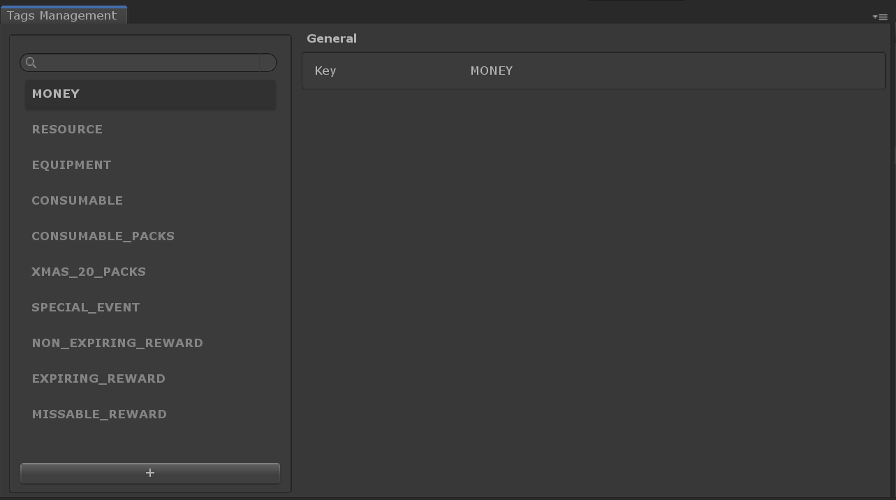

# Tag

## Overview

A __Tag__ is a short string (called a 'Key') that can be added to most [Catalog Items](../Catalog.md) to permit filtering in the Game Foundation Editor windows as well as through scripts.

There are many reasons to use __tags__.  You may want to regroup them and find all the items having a particular __tag__ using the [Inventory Manager], or enable a game feature for only items having a certain __tag__.  A [catalog item] can have as many __tags__ as needed.

It is identified by a string `id`.

## Editor Overview

The __Tags__ tab is visible for each type of [catalog item].

The layout is similar to the one for the [catalog items].

[catalog items]: ../Catalog.md#catalog-items
[catalog item]:  ../Catalog.md#catalog-items

[Inventory Manager]: ../GameSystems/InventoryManager.md
