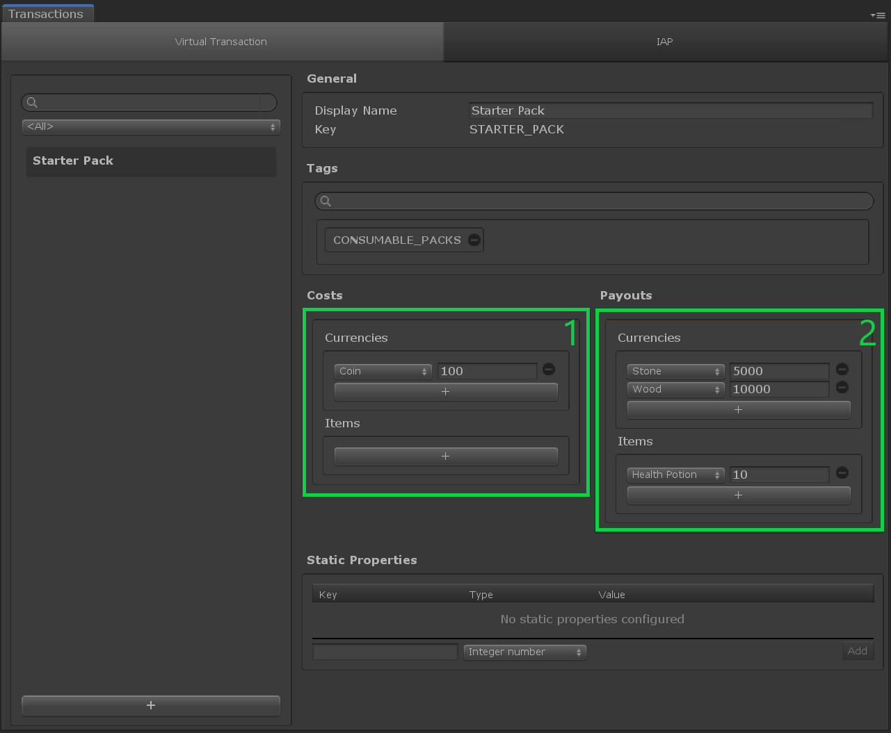

# Virtual Transaction

## Overview

A __Virtual Transaction__ manages the exchange of specific in-game items and/or currencies for other items and/or currencies. As the heart of your [Game Economy](../GameSystems/GameEconomy.md), virtual transactions can be extremely useful for a crafting system, for example, or to use currency to purchase items. Game play can decide when a transaction is executed and the appropriate costs are consumed and payouts received.  Each Virtual Transaction is a [catalog item] dedicated to purchases using virtual currencies and counterparts.

This type of transaction has 2 specifics fields:

- `Costs`: it describes the inputs from the transaction, the list of items and currencies the player needs to consume when processing this transaction.
- `Payouts`: it describes the outcome from the transaction, the list of items and currencies the player receives when processing this transaction.

The process of consuming the costs, and generating the payouts is done by the [Transaction Manager].

## Editor Overview

Open the __Transaction window__ by going to __Window → Game Foundation → Transaction__.
The Transaction window will let you configure both __Virtual Transactions__ and [IAP Transactions].

The interface is similar to the other [catalog items editor].

(1) The Costs section shows a list of [currencies] and [item definitions].
  Those are the input of the transaction.
  The amounts next to each entry are the number of those items the transaction will consume in order to produce the payouts.

(2) The Payouts section shows a list of [currencies] and [item definitions].
  Those are the output of the transaction.
  The amounts next to each entry are the number of those items the player will get from the transaction.

[catalog item]:  ../Catalog.md#Catalog-Items
[catalog items]: ../Catalog.md#Catalog-Items

[catalog items editor]: ../Catalog.md#Editor-Overview

[transaction manager]: ../GameSystems/TransactionManager.md

[iap transactions]: IAPTransaction.md

[currencies]: Currency.md

[item definitions]: InventoryItemDefinition.md
