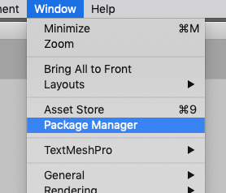
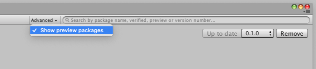
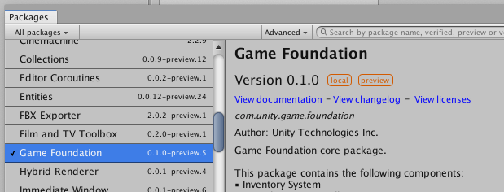
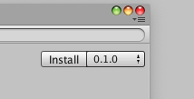
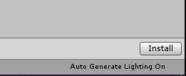
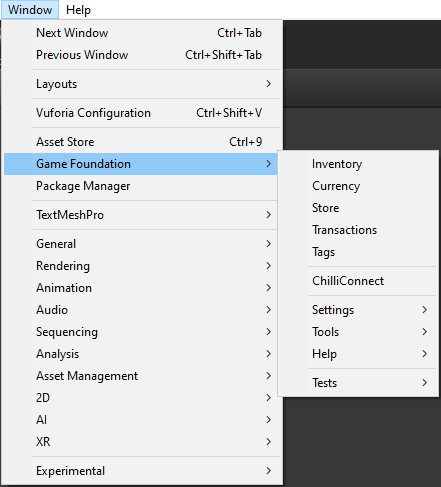
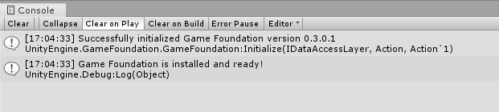

# Installing the Game Foundation package

1. In the Unity Editor, open the Package Manager window 
    (menu: **Window** → **Package Manager**).
    
    

2. In the **Package Manager** window, click **Advanced** and make sure that **Show preview packages** is enabled.
    
    

3. In the list of packages on the left, find **Game Foundation** and select it.
    
    

4. In the upper-right (bottom-right on some versions of Unity), click on the **Install** button.                                                                 
    
           

5. After installation, the Game Foundation menu items and editor windows are available in your Unity project in the **Window** menu.        
    
    

## Quick start

Before Game Foundation can be used during runtime, it has to be initialized in your code. 
The following is an example of initializing Game Foundation with the Start method of a MonoBehaviour.

```Csharp
using System.Collections;
using UnityEngine;
using UnityEngine.GameFoundation;
using UnityEngine.GameFoundation.DefaultLayers;
using UnityEngine.Promise;

public class MyGameManager : MonoBehaviour
{
    IEnumerator Start()
    {
        // This data layer will not persist any data, it is usually used for examples or tests.
        MemoryDataLayer dataLayer = new MemoryDataLayer();

        // - Initialize Game Foundation for runtime access.
        // - We use a using block to automatically release the deferred promise handler.
        using (Deferred initialization = GameFoundationSdk.Initialize(dataLayer))
        {
            yield return initialization.Wait();
        }
    }
}
```

When you initialize Game Foundation, all managers, including `InventoryManager`, `WalletManager`, `TransactionManager`, and `RewardManager` will be initialized and ready to use.

**Tip:** To verify that Game Foundation is working and installed correctly, please null-check any Game Foundation manager.

```Csharp
using System.Collections;
using UnityEngine;
using UnityEngine.GameFoundation;
using UnityEngine.GameFoundation.DefaultLayers;
using UnityEngine.Promise;

public class MyGameManager : MonoBehaviour
{
    IEnumerator Start()
    {
        // This data layer will not persist any data, it is usually used for examples or tests.
        MemoryDataLayer dataLayer = new MemoryDataLayer();

        // - Initialize Game Foundation for runtime access.
        // - We use a using block to automatically release the deferred promise handler.
        using (Deferred initialization = GameFoundationSdk.Initialize(dataLayer))
        {
            yield return initialization.Wait();
        }

        // Verify that the manager is initialized.
        if (GameFoundationSdk.inventory != null)
        {
            Debug.Log("Game Foundation is installed and ready!");
        }
        else
        {
            Debug.LogError("Error:  Game Foundation was unable to initialize. Please check online help or docs for more information.");
        }
    }
}
```

After implementing the above code, when you press Play you will see that Game Foundation has been successfully installed and ready to build your game!



Game Foundation also lets you override fixed catalog data at initialization using the External Value Provider. For more detail, please visit the [IExternalValueProvider](ExternalValueProvider.md) page. 

Now you can head over to one of our Tutorials for more information:

1. [Creating an Inventory Item Definition](Tutorials/01-CreatingAnItemDefinition.md)
1. [Playing with items at runtime](Tutorials/02-PlayingWithRuntimeItem.md)
1. [Creating a Currency](Tutorials/03-CreatingCurrency.md)
1. [Playing with currencies at runtime](Tutorials/04-PlayingWithRuntimeCurrency.md)
1. [The Debugger window](Tutorials/05-Debugger.md)
1. [Static Properties](Tutorials/06-StaticProperties.md)
1. [Mutable Properties Editor](Tutorials/07-MutablePropertiesEditor.md)
1. [Playing with mutable properties at runtime](Tutorials/08-MutablePropertiesRuntime.md)
1. [Creating a Virtual Transaction](Tutorials/09-CreatingAVirtualTransaction.md)
1. [Playing with virtual transaction at runtime](Tutorials/10-PlayingWithRuntimeVirtualTransaction.md)
1. [Using IAP Transactions](Tutorials/11-PlayingWithIAPTransaction.md)
1. [Filtering transactions with Stores](Tutorials/12-FilterTransactionWithStore.md)
1. [Working with Store Prefabs](Tutorials/13-WorkingWithStorePrefabs.md)
1. [Working with Promotion Popup Prefab](Tutorials/14-WorkingWithPromotionPopupPrefab.md)
1. [Configure your game with parameters](Tutorials/15-ConfigureYourGameWithParameters.md)

Also, please visit [Known Issues](KnownIssues.md) if you need further assistance.
