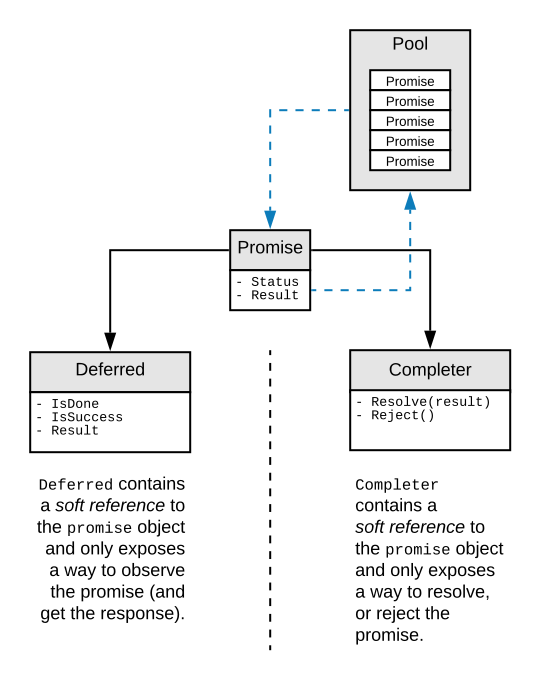

# Promises

## Goals

A `promise` is a small object in memory, dealing with the result of an asynchronous process.
This is an attempt to avoid allocations due to asynchronous calls.

#### Callbacks
when attaching callbacks to a process, there is always a chance for the callback to be missformed.

#### Coroutine
`Coroutines` are pretty convenient sometimes, but they cannot return value, and each created routine allocates, and are not reused.

#### Tasks
`await`/`async` is really elegant, but they allocates because it creates Task objects.

## Why not accessing the Promise directly?

`Promises` come from a pool.
To reuse it, it takes the developer to release it.
The problem with pooled object is that we have no control over the fact that the developer really doesn't keep a reference to the promise.

`Deferred` and `Completer` share a key with the active promise and they can interact with it as long as they have the same key.

When a promise is released, its key is reset, so the linked deferred and completer cannot interact with it anymore.

`Deferred` and `Completer` are structures.
They don't allocate.

