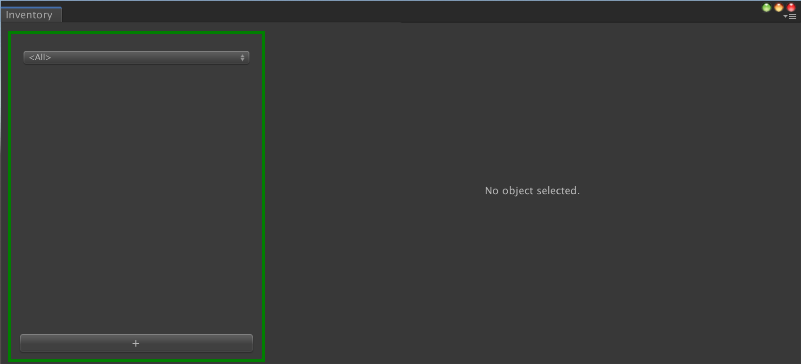
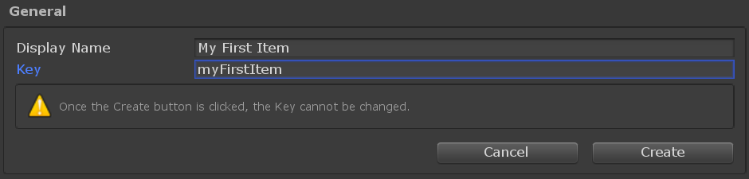
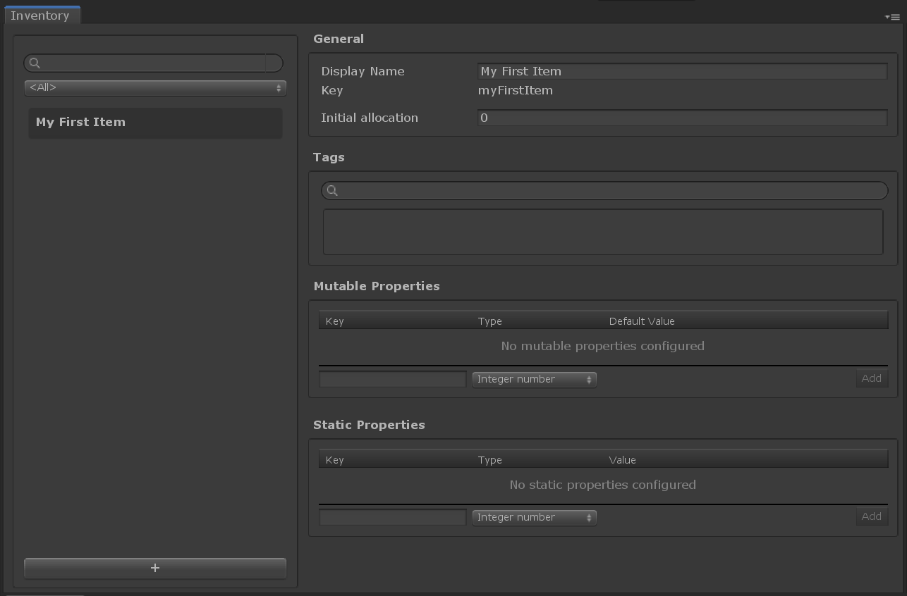

# Game Foundation Tutorials

## Creating an Inventory Item Definition

You may want to create in-game resources for your game, that the user can earn, purchase or consume. Using the inventory system provided by Game Foundation, you can easily create such a system for your game. 

Inventory items are instances created from an [Inventory Item Definition]. This [definition] serves like a schema or blueprint that contains all the static data the instance can refer to, as a description of its type. 

So first let's take a look how we can create such a definition for your in-game items.

### Open the Inventory Window

In order to create an [Inventory Item Definition], open the Inventory Window by selecting __Window → Game Foundation → Inventory__.  

You may see the following window:

The layout shows the first section, on the left (emphasised with a green box in the screenshot).
This section shows the list of [definitions] you've already created.
For the moment, you have none, so let's create one.

### Create a new item definition

At the bottom of this section, you can see a large `+` button.
It's the one you'll click on to start creating a new [definition].
Click on it now.

The right side of the layout is now updated and shows a simple form.

You can focus on giving your definition a `display name`.
The UI will convert this `display name` into a `key` automatically.
Of course, you can also choose to define your own `key`.  

> This display name is used by the editor itself, but you can use it inside your game too.

When done, click on the `Create` button on the bottom right-hand corner of the section.

### Configure your item definition

With the item "My First Item" selected on the left, you now can see the full configuration form displayed on the right-hand side of the window.

You still have the possibility to modify the `display name` of the [item definition], but the `key` is now read-only.

You now can see three additional sections below the General section: _Tags_, _Mutable Properties_, and _Static Properties_.

### Attach a tag to your item definition

The _Tags_ section is an intuitive widget to link the selection [definition] to a [tag].

You can type a [tag] name directly in the search field.  
If the tag already exists, a list will appear, showing [tags] matching with the characters you've already typed.
If the tag you've typed doesn't exist, you can click the `Add` button to create the [tag] and assign it to the [definition] right away.

You can also unassign a [tag] by clicking on the `-` button next to it.

Go to [the next tutorial] to see what we can do with this [item definitions].

[inventory item definition]: ../CatalogItems/InventoryItemDefinition.md "Go to Inventory Item Definition"
[definition]:                ../CatalogItems/InventoryItemDefinition.md "Go to Inventory Item Definition"
[definitions]:               ../CatalogItems/InventoryItemDefinition.md "Go to Inventory Item Definition"
[item definition]:           ../CatalogItems/InventoryItemDefinition.md "Go to Inventory Item Definition"
[item definitions]:          ../CatalogItems/InventoryItemDefinition.md "Go to Inventory Item Definition"
[tag]:   ../CatalogItems/Tag.md "Go to Tag"
[tags]:  ../CatalogItems/Tag.md "Go to Tag"
[currency]: ../CatalogItems/Currency.md
[the next tutorial]: 02-PlayingWithRuntimeItem.md
