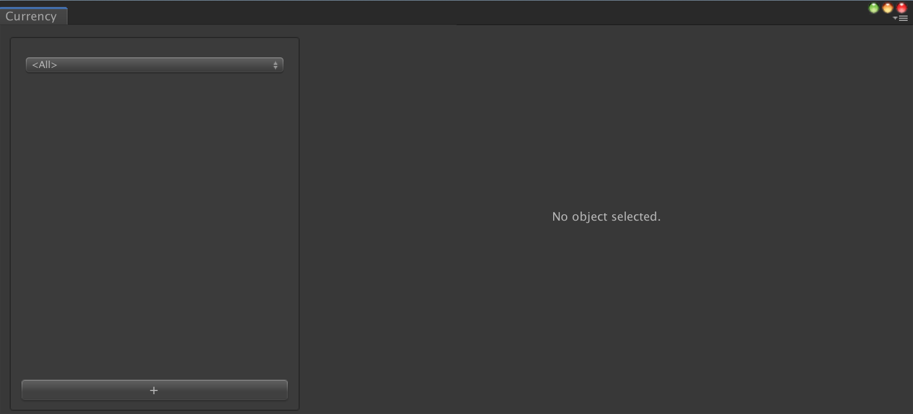
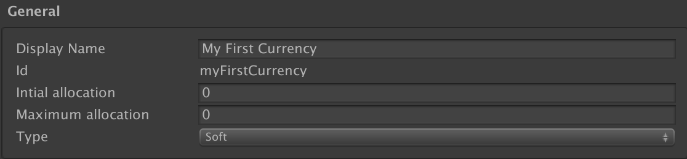

# Game Foundation Tutorials

## Creating a Currency

You may want to deal with a collectible resource, but don't need to identify each instance of the resource.
The most obvious example of this kind of resource is in-game virtual currency.
You don't need to give an identity to each coin in your wallet, and you'd need to collect thousands, millions of them.

A [Currency] is the type of [catalog item] you need. It can help track the quantity of such virtual resources without the additional overhead of item instances, unlike [inventory]. 

Now let's look at how we can create such a concept very easily using Game Foundation. 

### Open the Currency Window

In order to create a [Currency], you need to open the Currency Window.
Open the Currency Window by selecting __Window → Game Foundation → Currency__.  
You will see the following window.

As you can see, the layout is similar to the Inventory window.

### Create a new currency

Similar to the [Item Definition tutorial], clicking on the `+` button at the bottom of the left section shows the `id` field, the `display name` field and the `Create` button in the section on the right.

After creation, the editor shows some currency specific fields:

- `Initial allocation` is the amount of this [currency] a new player can have.
- `Maximum allocation` is the limit of this [currency] the player can possess.
  0 means no limit.
- The `type` of this [currency] can be `soft`, or `hard`.
  This property doesn't change the way the currency is handled by Game Foundation, but it helps you organize your data.

Apart from those specific fields, a [currency] has the same features as an [inventory item definition].

With this [currency] created, we now can switch back to the code with the [next tutorial].

[currency]: ../CatalogItems/Currency.md

[catalog item]: ../Catalog.md#Catalog-Items

[Item Definition tutorial]: 01-CreatingAnItemDefinition.md

[inventory item definition]: ../CatalogItems/InventoryItemDefinition.md

[inventory]: ../GameSystems/InventoryManager.md

[next tutorial]: 04-PlayingWithRuntimeCurrency.md
