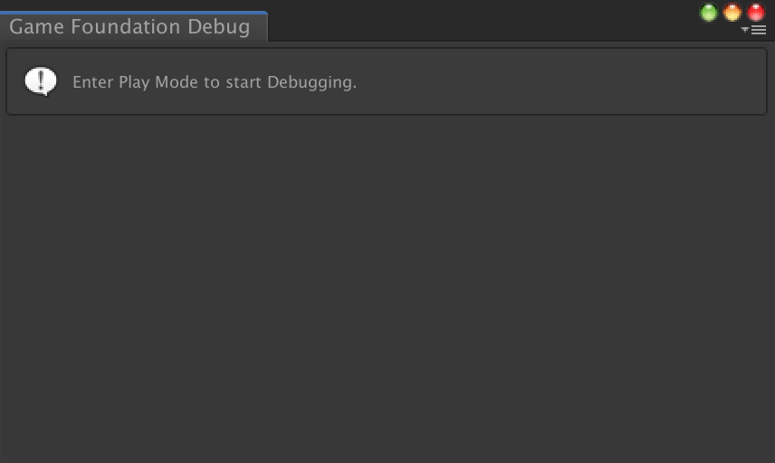
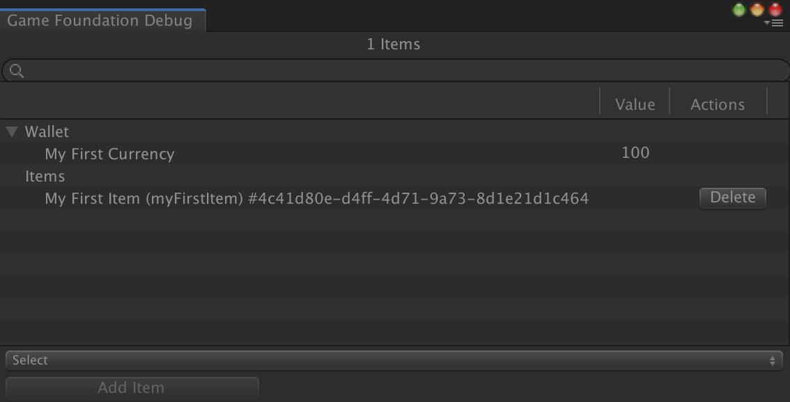
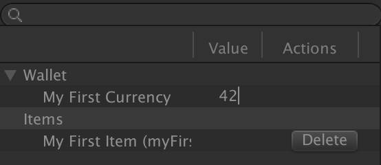
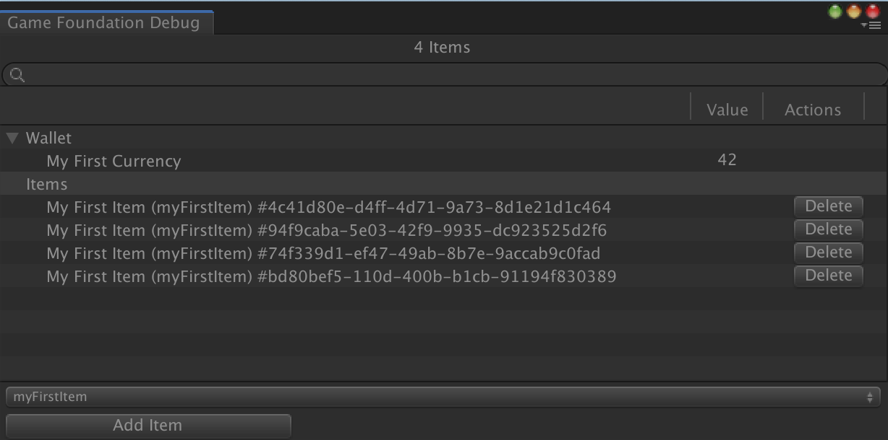

# Game Foundation Tutorials

## The Debugger window

Your game may have to deal with a big player profile, full of [item instances] and [currency] balances.

Having an overview of the player [wallet] and [inventory] is important for debugging.
Game Foundation comes with a built-in debugger window.

### Open the debugger window

Open the Debugger Window by selecting  __Window → Game Foundation → Tools → Debugger__.  
You should see the following window.

This window is empty at the moment, because you're not in `Play Mode`, so the window cannot find a running Game Foundation to link to.

So let's make it happen.
Please follow the [item creation steps found in the inventory tutorial], then come back here to see how to play with the Debugger Window.

### Monitoring the player profile

Start your scene with the Debugger Window opened.

The Debugger Window show two root nodes: _Wallet_ and _Items_.

By unfolding the _Wallet_ node, you can see the balances of all the existing [currencies].  
The _Items_ node unfolded shows the item created by the script, with the `display name` and `id` of its definition, then its `item id`.

### Modify the player profile with the Debugger

Stay in Play Mode, and click on the balance of "My First Currency".
You should be able to modify it.
Modifying this value will automatically modify the balance of this currency in Game Foundation.

At the bottom of this window, you can see two components: a _selection component_ and an _Add Item_ button.

Click on the selection component and select a definition, then click on the _Add Item_ button a couple of times.

For each click, a new item has been created.
For each of those, you have a `Delete` button which you can click on to remove it from the [Inventory Manager].

[item instances]: ../CatalogItems/InventoryItemDefinition.md

[currency]:   ../CatalogItems/Currency.md
[currencies]: ../CatalogItems/Currency.md

[wallet]: ../GameSystems/WalletManager.md

[inventory]:         ../GameSystems/InventoryManager.md
[Inventory Manager]: ../GameSystems/InventoryManager.md

[item creation steps found in the inventory tutorial]: 02-PlayingWithRuntimeItem.md#creating-an-item-instance
