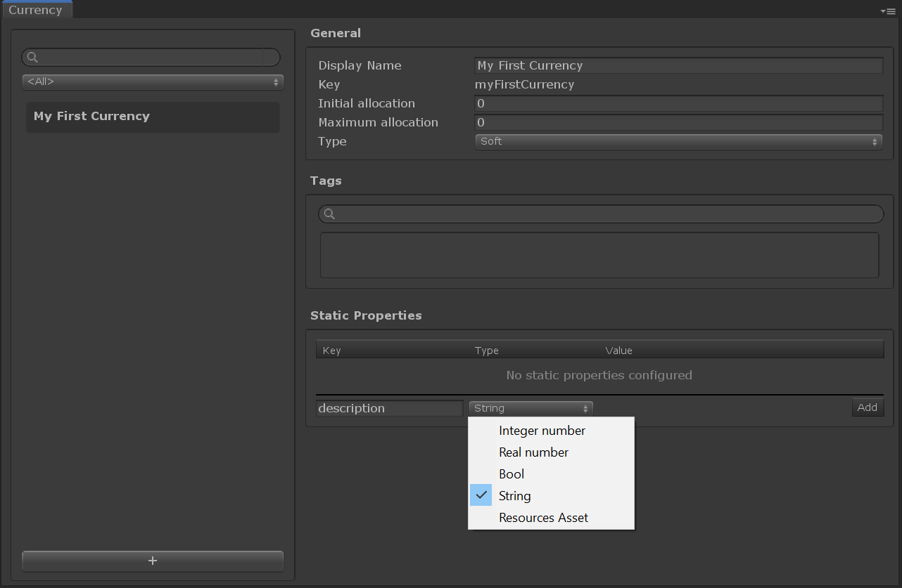
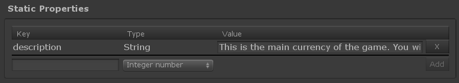

# Game Foundation Tutorials

## Adding static data with Static Properties

Creating [catalog items] is the first step towards describing the static data of your in-game items. With that, we have: 
* a `display name` for our new resource type
* a `key` that we can use to reference that definition
* and optionally `tag` to help us manage resources with taxonomy
  
Next we need to describe the additional static data to make the item definition useful. For that, the static properties will allow you to define custom data schema for a given catalog item type.

### Declare a property

Creating a property is easy, you simply need to:
- Create a valid `key` (alphanumeric characters with '-' and '_').
- Select the `type` of your property. Supported types are `integer number` (e.g. int & long), `real number` (e.g. float & double), `bool`, `string` and `resources asset` (e.g. any asset stored in a Resources folder).

For this tutorial, let's try add a `description` to the currency we created [earlier].



Now you simply have to add the description of your choice.



### Getting the property at runtime

Let's switch to the coding part now.  
As a prerequisite step, please follow the [initialization steps you can find in the inventory tutorial].

With your script created, go to the `OnInitSucceeded` method, and replace it with the following code

```cs
void OnInitSucceeded()
{
    Debug.Log("Game Foundation is successfully initialized");

    // Use the key you've used in the currency tutorial.
    const string definitionKey = "myFirstCurrency";

    // Finding a currency takes a non-null string parameter.
    Currency definition = GameFoundationSdk.catalog.Find<Currency>(definitionKey);

    // Make sure you retrieved a valid currency.
    if (definition is null)
    {
        Debug.Log($"Definition {definitionKey} not found");
        return;
    }

    Debug.Log($"Definition {definition.key} ({definition.type}) '{definition.displayName}' found.");

    // Use the key you've just created in the editor.
    const string propertyKey = "description";

    // Since we know the property's type, we can directly get the property as a string.
    string description = definition.GetStaticProperty(propertyKey);

    // A safer way to get the property is by using TryGetStaticProperty to make sure the key is right.
    if (definition.TryGetStaticProperty(propertyKey, out Property descriptionProperty))
    {
        // To get the string value out of the retrieved property simply use the AsString method.
        description = descriptionProperty.AsString();

        Debug.Log($"Static property '{propertyKey}' found; value: '{description}'");
    }
    else
    {
        // The key couldn't be found, maybe we made a type in the editor or in this script.
        Debug.LogError($"Static property {propertyKey} not found");
    }
}
```

Compile and start your scene.
You should see a new log entry:

```
! Static property 'description' found; value: 'This is the main currency of the game. You will earn it by performing different actions.'
```

### Conclusion

That's it for the Static Properties.
As you could see they are useful to store additional data in your catalog items.

There is also a way to store data that will change at runtime in certain catalog items, which we will cover in the [next tutorial].


[catalog items]: ../Catalog.md#Catalog-Items

[earlier]: 03-CreatingCurrency.md

[initialization steps you can find in the inventory tutorial]: 02-PlayingWithRuntimeItem.md#initialization-of-game-foundation-at-runtime

[next tutorial]: 07-MutablePropertiesEditor.md
