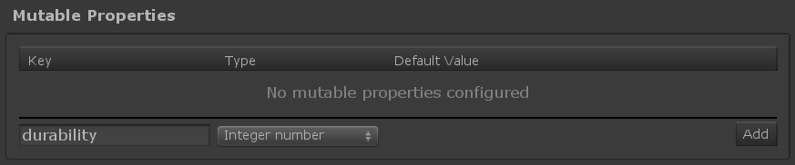
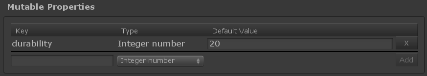

# Game Foundation Tutorials

## Adding mutable data with Mutable Properties

With the [Static Properties], we've seen how to add [static properties] to enhance a [catalog item].
This system wouldn't be complete without a solution to play with mutable data at the instance level.
A piece of equipment can wear down, a character can level up, ammunition can decrease, ... those properties are mutable.

To solve this aspect, Inventory Items have Mutable Properties.

We'll see in this tutorial how to define them, and [the following tutorial] will focus on using them at runtime.

### Declare your property in the Inventory Item Definition

You can create properties for your [item definition] directly inside the _Mutable Properties_ section.\
All you have to do is:
- Give it a valid name, i.e. alphanumeric characters with '-' and '_'.
- Select a type. Supported types are `integer number` (e.g. int & long), `real number` (e.g. float & double), `bool`, `string` and `resources asset` (e.g. any asset stored in a Resources folder).

Create your property according to the screenshot above.
- `Key`: "durability"
- `Type`: choose `integer number`

Now that the property is created, you can define its default value (we've put `20`).
That means when an item instance is created from this [item definition], its value for `"durability"` will be `20`.

### Conclusion

We can now configure an [item definition] with mutable properties.
[The next step] is to manipulate this mutable property at runtime.

[static properties]: 06-StaticProperties.md

[catalog item]: ../Catalog.md#catalog-items

[item definition]: ../CatalogItems/InventoryItemDefinition.md

[the following tutorial]: 08-MutablePropertiesRuntime.md
[the next step]:          08-MutablePropertiesRuntime.md
