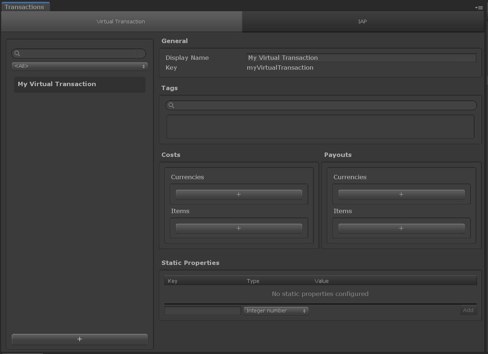
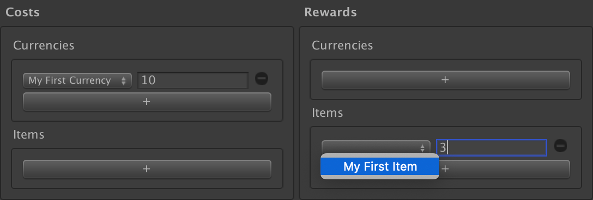

# Game Foundation Tutorials

## Creating a Virtual Transaction

We know how to [create an Inventory Item Definition].
We know how to [create a Currency].  
We've learned how to [create and destroy item instances] and how to [play with the wallet manager].  
You have the basics to start your game economy.
You'll probably have to build a process spending [currencies] to buy items, or crafting a better item by merging a list of ingredients.  
What if Game Foundation provided this feature out-of-the-box?

A [Virtual Transaction] is a [catalog Item] describing a recipe: a list of ingredients as `costs`, and a list of outputs as `payouts`.  

To create a Virtual Transaction, you need to open the Transaction Window by selecting __Window → Game Foundation → Transaction__.

The window shows two tabs:

- The _Virtual Transaction_ tab: the one we'll play with in this tutorial
- The _IAP Transaction_ tab: covered by [the IAP tutorial].

### The virtual transaction editor

The creation process is similar to the other [catalog items] we've already seen in the previous tutorials.

Make a new [Virtual Transaction] and call it `"My Virtual Transaction"`.

The [virtual transaction] editor shows two specific, similar-looking sections: _Costs_ and _Payouts_.

They both provide the ability to create a list of [currencies], and a list of [item definitions].
_Costs_ are the recipe ([items] and [currencies] consumed during the [transaction]), and _Payouts_ are the output ([items] and [currencies] generated by the [transaction]).  
The `+` button on each part is a first step to add entries to those lists.

### Configuring the virtual transaction

Let's define our transaction as a typical exchange "[currency] for [item]".
We want to:

- get `3` instances of our existing [item definition]
- in exchange for `10` of our [currency].

In the _Costs_ section, under the [currency] sub-section, click on the `+` button.
You'll see the list of the existing [currencies] defined in the _Currency Window_.  
Choose `"My First Currency"` and set the quantity to `10`.

In the _Payouts_ section, under the [item] sub-section, click on the `+` button.
You'll see the list of the existing [item definitions] defined in the _Inventory Window_.  
Choose `"My First Item"` and set the quantity to `3`.

Your [virtual transaction] is now properly configured.
In [the next tutorial], we'll see how to initiate a purchase, using this [transaction].

[create an inventory item definition]: 01-CreatingAnItemDefinition.md

[create a currency]: 03-CreatingCurrency.md

[create and destroy item instances]: 02-PlayingWithRuntimeItem.md

[play with the wallet manager]: 04-PlayingWithRuntimeCurrency.md

[virtual transaction]: ../CatalogItems/VirtualTransaction.md
[transaction]:         ../CatalogItems/VirtualTransaction.md

[catalog item]:  ../Catalog.md#catalog-items
[catalog items]: ../Catalog.md#catalog-items

[currencies]: ../CatalogItems/Currency.md
[currency]:   ../CatalogItems/Currency.md

[item definitions]: ../CatalogItems/InventoryItemDefinition.md
[item definition]:  ../CatalogItems/InventoryItemDefinition.md
[item]:             ../CatalogItems/InventoryItemDefinition.md

[the next tutorial]: 10-PlayingWithRuntimeVirtualTransaction.md
