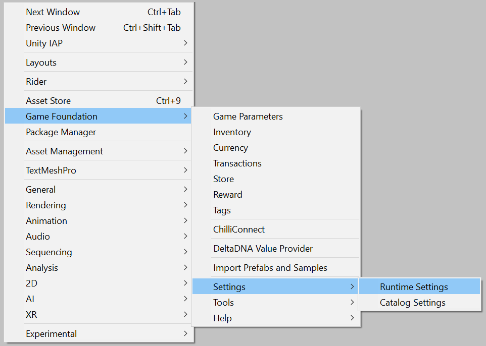

# Game Foundation Tutorials

## Using IAP Transactions

[IAP Transactions] can be an essential part of your product as they can help turn your game into a profitable business.

The mechanism is much the same as for the [Virtual Transaction].
The fundamental difference is that it turns real money into virtual goods.
You'll use a similar editor to describe the transactions, and then use the same APIs to initiate them.

In order to use in-app purchases in your game, you'll need to set up an app and a product in your platform store (e.g. App Store, Google Play, etc.).
Once that is set up, you can follow the below steps to get Unity's Purchasing SDK and Game Foundation to do most of your IAP work for you.

### Getting set up

1. Follow [instructions on how to enable and import the IAP SDK via the Services Window].

    > **Tip:** Game Foundation and IAP SDK can be installed in any order. However, you won't be able to enable the IAP option in the Game Foundation runtime settings until the IAP SDK is imported and compiled.

2. Select Runtime Settings from the Game Foundation menu.

    

3. Enable Unity Purchasing integration by checking the box.

    

4. Configure your products in the IAP Catalog window ([instructions here](https://docs.unity3d.com/Manual/UnityIAPDefiningProducts.html)).

### The IAP Transaction Editor

To create a [Virtual Transaction], you need to open the __Transaction Window__ by selecting __Window → Game Foundation → Transaction__, and display the second tab, called _IAP_.

In order to see the specifics of the [IAP Transaction] editor form, please create a new one.

The creation form is similar to the one displayed for the [Virtual Transaction], except that the _Product Ids_ section takes the place of the _Costs_ section.


### Product IDs

Initiating an [IAP Transaction] calls the IAP SDK with the `product id` defined in the platform stores (Google Store, Apple App Store).
The _Product IDs_ section exposes the fields you can use to link the transaction to those products.
We currently support Google and Apple.
Any product IDs you enter also need to be entered into the IAP Catalog (which you configured in Step 4 above), or they won't be found at runtime.

Fill these fields with the IAP product you have configured in your store.
It is not necessary to have both fields filled as long as you compile your app only for the platform you've configured properly.

### Payouts 

The _Payouts_ section is exactly the same than the one used for [Virtual Transactions].
For this tutorial, let's be generous and reward the player with 'My First Currency' x 1000 currency and 'My First Item' x 5.


### In your code

Similar to previous tutorials, you'll need to initialize Game Foundation.

Processing an IAP Transaction is done in the same way as processing a Virtual Transaction, as seen in the [previous tutorial].

IAP Transactions are asynchronous, meaning that from the time you click the button to the time the transaction is done being processed, it could take a while.
It's recommended that your UI take this into consideration. As soon as the purchase button is tapped/clicked, you should disable it to prevent accidental multiple attempts at processing the transaction.
Virtual Transactions can also be asynchronous if you are using a cloud backend data layer, so you would want to make the same consideration.

### Optional local receipt validation

As an added layer of security for IAP, you can enable local receipt validation, which is provided by the IAP SDK. It's recommended that you become familiar with [how the IAP SDK handles receipt validation]. Game Foundation lets you skip some of the steps. Using it requires two things:

- Follow the instructions in [Obfuscating encryption keys]. This will create new files in your Assets folder.
- After initializing Game Foundation, create a validator object using the generated 'tangles', and then assign that to the TransactionManager.
    ```cs
    using UnityEngine;
    using UnityEngine.GameFoundation;
    using UnityEngine.GameFoundation.DefaultLayers;
    using UnityEngine.Purchasing.Security;

    IEnumerator Start()
    {
        yield return GameFoundationSdk.Initialize(new MemoryDataLayer());

        GameFoundationSdk.transactions.SetIAPValidator(new CrossPlatformValidator(
            GooglePlayTangle.Data(), AppleTangle.Data(), Application.identifier));
    }
    ```

### Non-consumable purchases

One or more of your IAP products may be non-consumable (as configured in your platform setup(s) and IAP Catalog). If the player already owns a non-consumable product, you'll want to prevent them from purchasing that product again in your UI. Game Foundation automatically keeps track of owned non-consumable product ids, and you can check on a particular product id like this:

```cs
if (GameFoundationSdk.transactions.IsIapProductOwned(
        "com.mycompany.mygame.permanent-bonus"))
{
    // disable the button to buy the Permanent Bonus
}
```

> Note: The above method relies on a text file stored in the game's local persistent data, and as such is _not_ tamper-proof. The best solution to prevent tampering and cheating is a cloud-backed solution.

### Conclusion

Making your game a successful business is now easier with a turn-key purchasing solution.
Having a store, populated with virtual transactions and in-app purchasing transactions that you can easily reconfigure is a must for a good liveOps.

Because you need your retention to be great, and the user experience to be fine tuned, you may need to organize the products you want to sell, or maybe displaying only part of the offers based on conditions (like the player level).  
Game Foundation has a solution for you: [Stores], that are covered in [the next tutorial].


[iap transactions]: ../CatalogItems/IAPTransaction.md
[iap transaction]:  ../CatalogItems/IAPTransaction.md

[virtual transaction]:  ../CatalogItems/VirtualTransaction.md
[virtual transactions]: ../CatalogItems/VirtualTransaction.md

[instructions on how to enable and import the IAP SDK via the Services Window]: https://docs.unity3d.com/Manual/UnityIAP.html

[previous tutorial]: 10-PlayingWithRuntimeVirtualTransaction.md#initiating-the-transaction

[stores]: ../CatalogItems/Store.md
[the next tutorial]: 12-FilterTransactionWithStore.md

[how the IAP SDK handles receipt validation]: https://docs.unity3d.com/Manual/UnityIAPValidatingReceipts.html

[Obfuscating encryption keys]: https://docs.unity3d.com/Manual/UnityIAPValidatingReceipts.html
