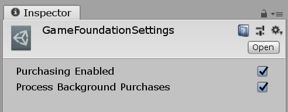
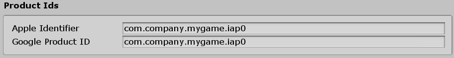
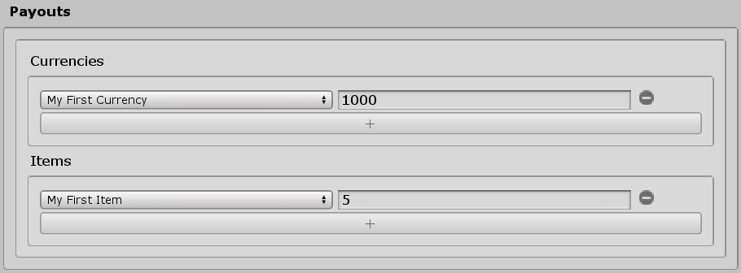

# Game Foundation Tutorials

## Using IAP Transactions

[IAP Transactions] can be a great monetization tool to help turn your game into a profitable business.

IAP transactions work similarly to [Virtual Transactions]. The fundamental difference is that while virtual transactions consist of converting virtual money into virtual goods, IAP transactions turns real money into virtual goods. The process of creating an IAP transaction is similar to Virtual transactions because you use the same editor interface to describe the transactions, and then use the same APIs to initiate them.

To use in-app purchases in your game, you'll need to do the following:

* Set up an app and a product in your platform store (App Store or Google Play)
* Set up the IAP SDK in your project
* Create IAP transactions using the Transaction Editor
* Use IAP product IDs to link transactions to IAP products
* Set payouts for consumable IAP products, if applicable
* Process an IAP transaction
* Validate platform store receipts for an in-app purchase

This tutorial guides you through the process, from beginning to end, on how to implement the IAP SDK in your project to processing an IAP transaction in your game.

### Setting up the IAP SDK in your project

1. Follow [instructions on how to enable and import the IAP SDK via the Services Window in your project](https://docs.unity3d.com/Manual/UnityIAPSettingUp.html).

    > **Note:** You will need to import and compile the IAP SDK first to enable the IAP option in the Game Foundation runtime settings.

2. Open your project. Then, in the Unity Editor menu go to **Window** > **Game Foundation** > **Settings** > **Runtime Settings**.

3. In the Inspector, enable the **Purchasing Enabled** field to permit Unity Purchasing integration in your project.

    

4. Configure your products in the IAP Catalog window [according to these instructions](https://docs.unity3d.com/Manual/UnityIAPDefiningProducts.html). These products and their respective IDs will later be used when initiating IAP transactions.

### The IAP Transaction Editor

To create an [IAP Transaction], go to **Window** > **Game Foundation** > **Transaction**. The Transaction window will open. From the Transaction window, select the second tab, called **IAP**.

To see how the editor for an [IAP Transaction] differs from a Virtual transaction, click the '+' button. A form will open for you to create a new IAP Transaction. The creation form for IAP transactions is similar to the one displayed for the [Virtual Transaction], except that the **Costs** section is replaced by **Product IDs** for IAP transactions:

### Product IDs

Initiating an [IAP Transaction] calls the IAP SDK with the product ID defined in the platform stores (Note: currently only the Google Store and Apple App Store are supported). The **Product IDs** section exposes the fields you can use to link the transaction to those products. Any product IDs you enter also need to be entered into the IAP Catalog (see step 4 of the "Setting up the IAP SDK in your project" section), or they won't be found at runtime.

Fill these fields with the IAP product you have configured in your store. It is not necessary to have both fields filled as long as you compile your app only for the configured platform.



After entering products IDs, the editor will try to locate that product in the IAP Catalog. If the product ID is not found, a warning will display in the Editor console. In this case, make sure to configure that product ID in the IAP Catalog. If the product ID is found, now you can determine whether or not consumable payouts should be assigned to the product.

### Payouts 

When the IAP product is of the Consumable type, the **Payouts** section is exactly the same as the one used for [Virtual Transactions]. For this tutorial, let's be generous and reward the player with payouts of 'My First Currency' x 1000 and 'My First Item' x 5.



Non-consumable IAP product types do not allow you to specify payouts of consumable items. See the "Non-consumable purchases" section below in this tutorial for information about how to check if a player owns a non-consumable purchase.

### In your code

In your code, you will need to [initialize Game Foundation].

Processing an IAP Transaction is done in the same way as processing a Virtual Transaction, as seen in the [previous tutorial]. 

IAP Transactions are asynchronous, meaning that it may take some time from the moment you click the button to when the transaction is done being processed. This is why it's recommended that your UI take this into consideration. As soon as the purchase button is clicked, disable it to prevent multiple attempts to process the many accidental transactions. Virtual transactions can also be asynchronous if you are using a cloud back-end data layer, so you would want to make the same consideration for virtual transactions too.

### Optional local receipt validation

As an added layer of security for IAP, you can enable local receipt validation, which is provided by the IAP SDK. If you're unfamiliar, it's recommended that you become familiar with [how the IAP SDK handles receipt validation]. Game Foundation lets you skip some of the steps. Using it requires two things:

- Follow the instructions in [Obfuscating encryption keys]. This will create new files in your Assets folder.
- After initializing Game Foundation, create a validator object using the generated 'tangles', and then assign it to the TransactionManager.
    ```cs
    using UnityEngine;
    using UnityEngine.GameFoundation;
    using UnityEngine.GameFoundation.DefaultLayers;
    using UnityEngine.Purchasing.Security;

    IEnumerator Start()
    {
        yield return GameFoundationSdk.Initialize(new MemoryDataLayer());

        GameFoundationSdk.transactions.SetIAPValidator(new CrossPlatformValidator(
            GooglePlayTangle.Data(), AppleTangle.Data(), Application.identifier));
    }
    ```

### Non-consumable purchases

One or more of your IAP products may be non-consumable. If the player already owns a non-consumable product, you'll want to prevent them from attempting to purchase that product again in your UI. Game Foundation automatically keeps track of owned non-consumable product IDs, and you can check on a particular product ID as follows:

```cs
if (GameFoundationSdk.transactions.IsIapProductOwned(
        "com.mycompany.mygame.permanent-bonus"))
{
    // disable the button to buy the Permanent Bonus
}
```

> Note: The above method relies on a text file stored in the game's local persistent data, and as such is _not_ tamper-proof. The best solution to prevent tampering and cheating is using a cloud-backed solution.

> Note: Subscription type IAP products are not yet supported by Game Foundation, but when they are, they will work very similarly to non-consumable products.

### Conclusion

From creating stores and transactions using Game Foundation, and creating products for your stores using the IAP SDK, making your game a successful business is now easier with a turn-key purchasing solution. You can also achieve good liveOps by having a store populated with virtual transactions and IAP transactions that you can easily reconfigure.

To improve retention levels and positive user experience in stores, you may want to organize the products you sell, or, alternatively, display only a portion of all possible offers based on certain conditions (for example, player levels). For this scenario, Game Foundation has a solution for you: [Stores], that are covered in [the next tutorial].

[iap transactions]: ../CatalogItems/IAPTransaction.md
[iap transaction]:  ../CatalogItems/IAPTransaction.md

[virtual transaction]:  ../CatalogItems/VirtualTransaction.md
[virtual transactions]: ../CatalogItems/VirtualTransaction.md

[instructions on how to enable and import the IAP SDK via the Services Window]: https://docs.unity3d.com/Manual/UnityIAPSettingUp.html

[previous tutorial]: 10-PlayingWithRuntimeVirtualTransaction.md#initiating-the-transaction

[stores]: ../CatalogItems/Store.md
[the next tutorial]: 12-FilterTransactionWithStore.md
[initialize Game Foundation]: ../GameFoundationSdk.md

[how the IAP SDK handles receipt validation]: https://docs.unity3d.com/Manual/UnityIAPValidatingReceipts.html

[Obfuscating encryption keys]: https://docs.unity3d.com/Manual/UnityIAPValidatingReceipts.html
