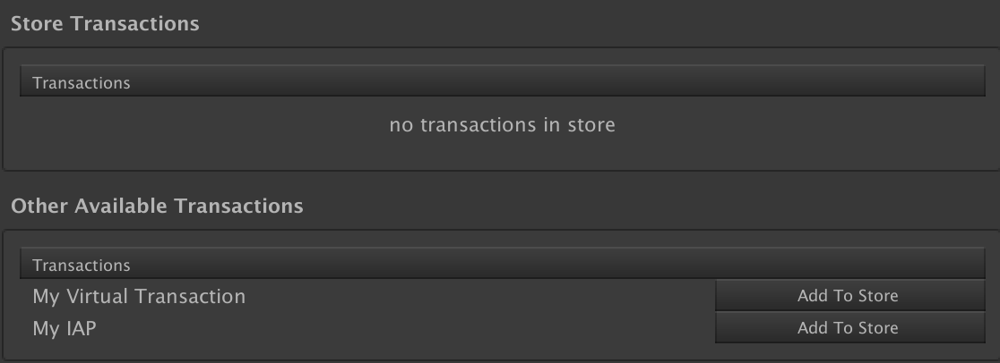
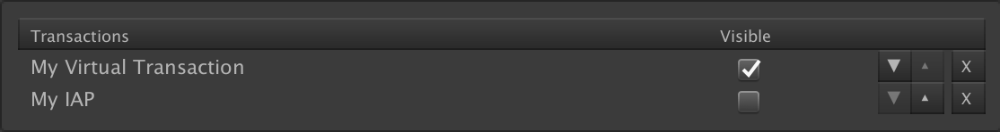

# Game Foundation Tutorials

## Filtering transactions with Stores

Ikea™ knows best: the guided customer experience makes your store more efficient.

[With transactions], we've seen how to turn items and currencies into buyable [virtual products], and turn those [virtual products] into a real business with [IAP Transactions].
But exposing a full, unordered list of offers to the player is not necessarily the best solution.
Depending on its style, its level, but also specific rules of your game, you may want to show a different subset of the products you want to sell.

[Stores] are [catalog items] dedicated to this aspect of your content creation.
In this tutorial, we'll see how to get the best of your content with them.

### The Store Window

In order to create [stores], open the __Store Window__ by selecting __Window → Game Foundation → Store__.  
You'll see a tab which you are now familiar with.
But this time, you have an item by default.
Game Foundation provides a default `main` store for you.

For the sake of this tutorial, we'll create a new one.
Click on the `+` button the create a new [store] with the display name `My Store` and id `myStore`.



The Store Transactions section shows a list with transactions already added to the store.
At the moment, this section is empty.

A second list called _Other Available Transactions_ is visible beneath it. These are the transactions that are able to be added to the Store Transactions section, but haven't been yet.
Click on the `Add To Store` button for each available transaction to add them to your store.



You can see your transactions as products of your store.
You have the possibility to order those products if you want to control their default order in your game.
You may want to show the most attractive products in the first places, but you could also have other strategies.

The `Visible` checkbox is a lazy way to remove a product from a store.
From the configuration standpoint, they are in your store, but at runtime, those products are ignored and inaccessible.
It helps you make quick content tests without dramatically changing the content of the stores.

Make the "My IAP" transaction invisible by unchecking its box.

### Getting Stores at runtime

With our store properly setup, it's now time to get access to them at runtime.

Please follow [the initialization step of Game Foundation] of [tutorial 02].
You should end up with the following code.

```cs
using System;
using System.Collections;
using UnityEngine;
using UnityEngine.GameFoundation;
using UnityEngine.GameFoundation.DefaultLayers;
using UnityEngine.Promise;

public class GFInit : MonoBehaviour
{
    IEnumerator Start()
    {
        // Creates a new data layer for Game Foundation,
        // with the default parameters.
        MemoryDataLayer dataLayer = new MemoryDataLayer();

        // - Initializes Game Foundation with the data layer.
        // - We use a using block to automatically release the deferred promise handler.
        using (Deferred initDeferred = GameFoundationSdk.Initialize(dataLayer))
        {
            yield return initDeferred.Wait();
    
            if (initDeferred.isFulfilled)
                OnInitSucceeded();
            else
                OnInitFailed(initDeferred.error);
        }
    }

    // Called when Game Foundation is successfully initialized.
    void OnInitSucceeded()
    {
        Debug.Log("Game Foundation is successfully initialized");
    }

    // Called if Game Foundation initialization fails 
    void OnInitFailed(Exception error)
    {
        Debug.LogException(error);
    }
}
```

[Stores] are static data.
They have their own catalog.
You'll find them in the `storeCatalog`.

Append the following snippet at the end of the `OnInitSucceeded` method.

```cs
const string storeName = "myStore";

Store store = GameFoundationSdk.catalog.Find<Store>(storeName);
if (store is null)
{
    Debug.LogError($"Cannot find {nameof(Store)} '{storeName}'");
    return;
}

Debug.Log($"{nameof(Store)} '{store.displayName}' found");
```

Start your scene, you should see the following log:

```
Store 'My Store' found
```

Now that you have access to the store, you can retrieve the list of available products.
Append the following snippet at the end of the `OnInitSucceeded` method.

```cs
var transactions = new List<BaseTransaction>();
store.GetStoreItems(transactions);
foreach (var transaction in transactions)
{
    Debug.Log($"{nameof(Store)} '{store.displayName}' contains '{transaction.displayName}'");
}
```

You should now see the following log in your console:

```
Store 'My Store' contains 'My Virtual Transaction'
```

Where is "My IAP"?  
Keep in mind we marked the "My IAP" transaction as invisible in a previous step of this tutorial.

### Conclusion

You now know how to create a Store and access its transactions via its API, but you still need to create the UI that handles displaying those transactions and initiating purchases for them, etc.

To help simplify our developers lives, we've created some prefabs and components that can be used to build your in game store.
Check out the [next section] of this tutorial to see where to find these prefabs and how to work with them.

### Final source code

```cs
using System;
using System.Collections;
using System.Collections.Generic;
using UnityEngine;
using UnityEngine.GameFoundation;
using UnityEngine.GameFoundation.DefaultLayers;
using UnityEngine.Promise;

public class GFInit : MonoBehaviour
{
    IEnumerator Start()
    {
        // Creates a new data layer for Game Foundation,
        // with the default parameters.
        MemoryDataLayer dataLayer = new MemoryDataLayer();

        // - Initializes Game Foundation with the data layer.
        // - We use a using block to automatically release the deferred promise handler.
        using (Deferred initDeferred = GameFoundationSdk.Initialize(dataLayer))
        {
            yield return initDeferred.Wait();
    
            if (initDeferred.isFulfilled)
                OnInitSucceeded();
            else
                OnInitFailed(initDeferred.error);
        }
    }

    // Called when Game Foundation is successfully initialized.
    void OnInitSucceeded()
    {
        Debug.Log("Game Foundation is successfully initialized");

        const string storeName = "myStore";

        Store store = GameFoundationSdk.catalog.Find<Store>(storeName);
        if (store is null)
        {
            Debug.LogError($"Cannot find {nameof(Store)} '{storeName}'");
            return;
        }

        Debug.Log($"{nameof(Store)} '{store.displayName}' found");

        var transactions = new List<BaseTransaction>();
        store.GetStoreItems(transactions);
        foreach (var transaction in transactions)
        {
            Debug.Log($"{nameof(Store)} '{store.displayName}' contains '{transaction.displayName}'");
        }
    }

    // Called if Game Foundation initialization fails 
    void OnInitFailed(Exception error)
    {
        Debug.LogException(error);
    }
}
```


[with transactions]: 09-CreatingAVirtualTransaction.md
[virtual products]:  09-CreatingAVirtualTransaction.md

[iap transactions]: 11-PlayingWithIAPTransaction.md

[stores]: ../CatalogItems/Store.md
[store]:  ../CatalogItems/Store.md

[catalog items]:  ../Catalog.md#catalog-items

[the initialization step of Game Foundation]: 02-PlayingWithRuntimeItem.md#initialization-of-game-foundation-at-runtime

[tutorial 02]: 02-PlayingWithRuntimeItem.md

[next section]: 13-WorkingWithStorePrefabs.md
