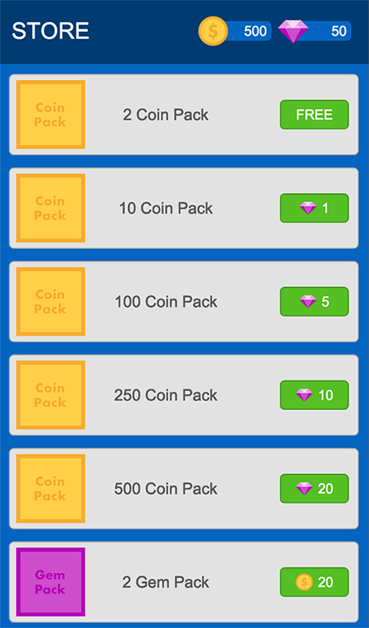
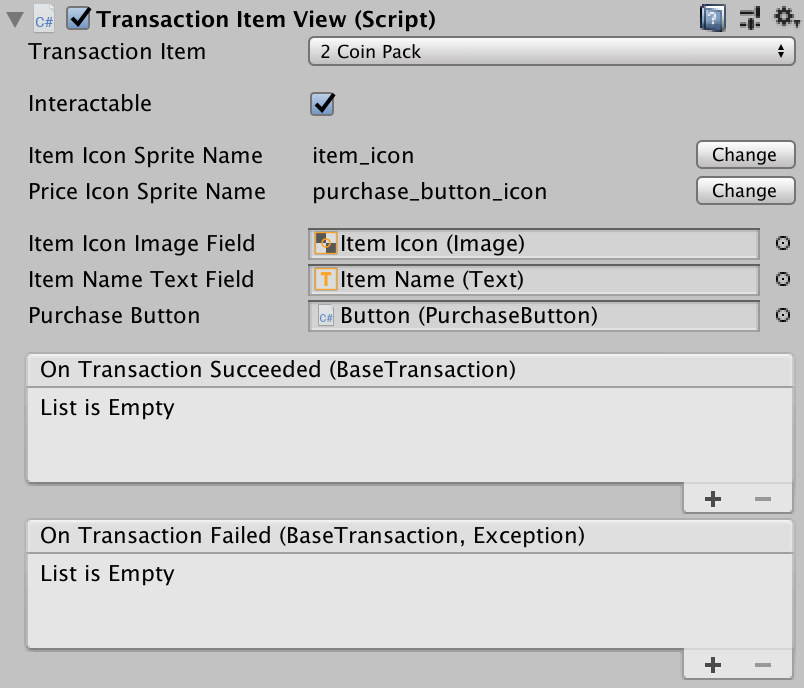
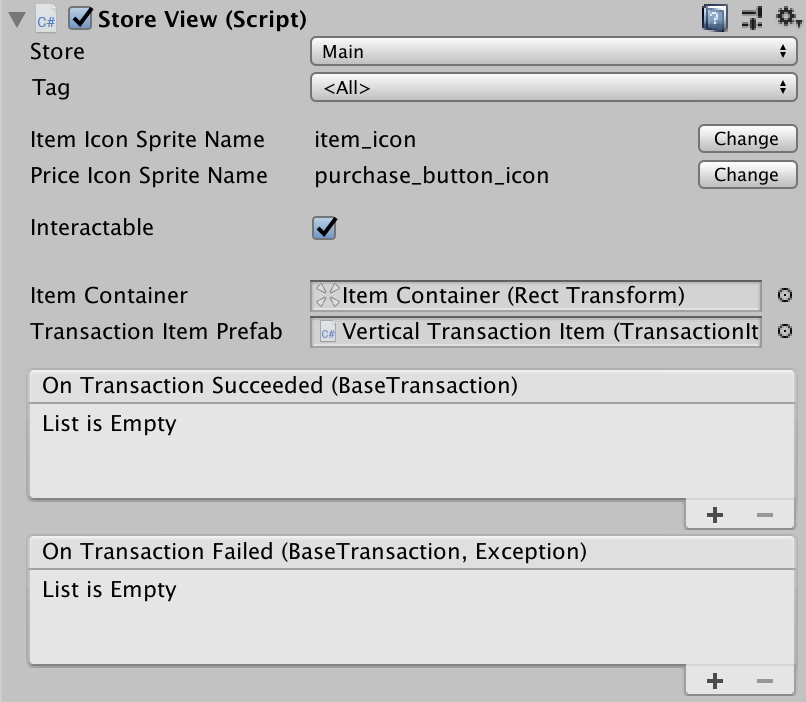

# Game Foundation Tutorials

## Working with Store prefabs

In this tutorial we'll go over all of the prefabs and components included in the Game Foundation package to make creating a [Store] in your game easier.

Above is one example of a layout that could be created using the provided prefabs.

While not all possible store layouts can be made using our prefabs, they provide the ability to build a lot of common layouts.
Further, the components provided can be attached to your own prefabs to do the work of accessing the Store API and processing transactions for you.

### Finding the prefab and component

The Game Foundation prefab package can be imported by going to `Window -> Game Foundation -> Import Prefabs and Samples`.
This will add a folder called `Game Foundation Prefabs` into your Assets folder.
Inside this folder you'll find all our UI Prefabs in the UI Prefabs folder, and sample scenes for how to work with them in the Samples folder.

The Store prefabs in particular can be found in `Game Foundation Prefabs/UI Prefabs/Store`.
You can drag any of them into your scene from there to customize.

The components that are used by these prefabs (or available to be used by your own custom prefabs) are located in the Game Foundation package inside the `Components` folder.

### Breaking down the prefabs

#### Huds

In the `Huds` folder (`Game Foundation Prefabs/UI Prefabs/Huds`) you'll find two very similar prefabs that can be used to show an image and quantity for an item.
The `Currency Hud` is for showing quantity of [Currencies], and the `Inventory Item Hud` shows the quantities of [Inventory Items].

Since Inventory Items don't have a built-in quantity concept, the component attached to this prefab displays an aggregated count of all the [Inventory Items] in the [Inventory Manager] that have the selected [Inventory Item Definition].

To see how to set up the Hud prefabs with the items you want, check out the [Hud components section].

#### Purchase Button

In the `Store` folder you'll find the Purchase Button prefab.
This is a relatively simple button with a very powerful component attached (see [Purchase Button component]).
In addition to the standard text field on the button, it also includes an image field for displaying an image of the item that is the cost to the [transaction].
It is used as a building block for the other store prefabs and is very adaptable to size and background image customization.

> Currently the Purchase Button prefab only supports Transactions that have one item as their cost (i.e. 10 gold is supported, but 10 gold and 2 diamonds is not).

To see how to set up the Purchase Button with the transaction you want, check out the [Purchase Button component section].

#### Transaction Items

There are three Transaction Item prefabs.
Each one has a spot for an image for the transaction, a text field for the name of the transaction, and a Purchase Button prefab.
The difference between them is simply the arrangement of these three game objects.
Each prefab's size, background image, and other features can be altered to fit your needs and adjusts in a responsive way.

To see how to set up the Transaction Item prefabs to display the transaction you want, check out the [Transaction Item View component section].

#### Stores

There are three store prefabs.
While they don't look like much at editor time (just an empty box), at runtime they will display all the transactions in your specified store using transaction item prefabs (as pictured above).
The difference between the three store prefabs is how they lay out the transactions: either in a vertical column ideal for portrait games, a horizontal column ideal for landscape games, or a grid view which could be used in either orientation.

Each prefab's background image, layout spacing, and other features can be altered to fit your needs and adjusts in a responsive way.

Although each store prefab comes preselected to use a transaction prefab that looks good with it, any store layout could be changed to use a different prefab using the attached [Store View component].
Note that with the Grid Store prefab, if the transaction prefab is changed, the Grid Layout Group's cell size will need to be adjusted to fit the new prefab.

> Currently the Store prefabs only support Transactions that have one item as their cost (i.e. 10 gold is supported, but 10 gold and 2 diamonds is not).
> Any transactions added to the selected store that don't fit those parameters will be filtered out from the display.

To see how to set up the Store prefabs to display the store you want, check out the [Store View component section].

### Breaking down the components

#### Hud components

The Currency and Inventory Item View components attach to a game object with image and text game objects and handle the displaying of the items icon and quantity.

In the case of the Inventory Item View, since Inventory Items don't have a built-in quantity concept, the component displays an aggregated count of all the Inventory Items in the [Inventory Manager] that have the selected [Inventory Item Definition].

Each Hud component has the following fields.
- Currency or Item: This is the Currency or Inventory Item to display in the hud.
- Icon Asset Property Key: The name of the icon asset to display in the hud, as specified in the item's static properties (type Resources Asset).
- Item Image Field: The game object with an Image component where the item's image should be displayed.
- Item Quantity Text Field: The game object with a Text component where the item's quantity should be displayed.

#### Purchase Button component

The Purchase Button component handles all the code necessary to display the cost of a transaction (either [virtual] or [IAP]), and for initiating and completing a purchase for that transaction.
It will automatically disable the button if a user doesn't have enough in their inventory or wallet to cover the cost of the transaction.

This component has the following fields:
- Transaction Item: This is the transaction the purchase button is linked to.
- Interactable: Boolean property that sets whether the button is interactable or not.
- Price Icon Asset Property: The name of the icon asset to display on the button, as specified in the static properties (type Resources Asset) of the transaction's cost item (either currency or inventory item).
- No Price String: The string to display if there is no cost specified for the transaction, by default it is `FREE`
- Price Image Field: The game object with an Image component where the image of the transaction's cost should be displayed.
- Price Text Field: The game object with a Text component where the transaction's price will be written.
For a [virtual transaction] that would be the quantity of the cost item, or for an [IAP transaction] that would be the real world cost of the transaction.
If there is no cost specified for the transaction, it will display the value specified in the No Price String property.
- On Purchase Success listener: Any method added here will be called when this button successfully completes a purchase. The method added should have a `BaseTransaction` parameter.
- On Purchase Failure listener: Any method added here will be called when this button fails to complete a purchase. The method added should have as its parameters a `BaseTransaction` and an Exception.

#### Transaction Item View component

The Transaction Item View component displays relevant info about its attached transaction (either [virtual] or [IAP]).

This component has the following fields:
- Transaction Item: This is the transaction the component is linked to.
- Interactable: Boolean property that sets whether the specified Purchase Button is interactable or not.
- Icon Asset Property Key: The name of the icon asset to display on the transaction item prefab, as specified in the static properties (type Resources Asset) of the transaction.
- Icon Image Field: The game object with an Image component where the transaction's icon should be displayed.
- Name Text Field: The game object with a Text component where the transaction's name will be displayed.
- Price Icon Asset Property: The name of the icon asset to display on the purchase button prefab, as specified in the static properties (type Resources Asset) of the transaction's cost item (either currency or inventory item).
- No Price String: The string to display if there is no cost specified for the transaction, by default it is `FREE`
- Purchase Button: The game object with a Purchase Button component attached that should be displayed. By default it is the Game Foundation Purchase Button prefab.
- On Transaction Succeeded listener: Any method added here will be called when this transaction item successfully completes a purchase. The method added should have a `BaseTransaction` parameter.
- On Transaction Failed listener: Any method added here will be called when this transaction item fails to complete a purchase. The method added should have as its parameters a `BaseTransaction` and an Exception.

#### Store View component

The Store View component displays all the transactions added to the selected store/tag combo.

> Currently the Store component only supports Transactions that have one item as their cost (i.e. 10 gold is supported, but 10 gold and 2 diamonds is not).
> Any transactions added to the selected store that don't fit those parameters will be filtered out from the display.

This component has the following fields:
- Store: This is the store the component is linked to.
- Tag: This specifies which tag to use when filtering the transactions that have been added to the selected store. If `<All>` is selected, transactions won't be filtered.
- Interactable: Boolean property that sets whether each transaction's purchase button is interactable or not.
- Item Icon Asset Property Key: The name of the icon asset to display on each transaction item prefab, as specified in the static properties (type Resources Asset) of the transactions.
- Price Icon Asset Property Key: The name of the icon asset to display on each transaction's purchase button prefab, as specified in the static properties (type Resources Asset) of the transaction's cost item (either currency or inventory item).
- No Price String: The string to display if there is no cost specified for any of the transactions, by default it is `FREE`
- Populated Item Container: The game object to which all the Transaction Item prefabs will be added.
- Item Prefab: The game object with a Transaction Item View component attached that will be used to display the store's transactions.
- On Transaction Succeeded listener: Any method added here will be called whenever any transaction in the store successfully completes a purchase. The method added should have a `BaseTransaction` parameter.
- On Transaction Failed listener: Any method added here will be called whenever any transaction in the store fails to complete a purchase. The method added should have as its parameters a `BaseTransaction` and an Exception.

### Conclusion

We hope these prefabs and components assist you when adding a simple store to your game, in addition to providing a useful jumping off point for any more advanced stores you may choose to create.
The [next section] of the tutorial will introduce you to another prefab we offer, which creates a pop up for advertising a special promotion, like a starter pack.

## 
< [_table of contents_](../TableOfContents.md)

[store]: ../CatalogItems/Store.md
[currencies]: ../CatalogItems/Currency.md
[inventory items]: 02-PlayingWithRuntimeItem.md#creating-an-item-instance
[inventory manager]: ../GameSystems/InventoryManager.md
[inventory item definition]: ../CatalogItems/InventoryItemDefinition.md
[hud components section]: #hud-components
[purchase button component]: #purchase-button-component
[transaction]: ../CatalogItems/VirtualTransaction.md
[virtual]: ../CatalogItems/VirtualTransaction.md
[iap]: ../CatalogItems/IAPTransaction.md
[purchase button component section]: #purchase-button-component
[store view component]: #store-view-component
[store view component section]: #store-view-component
[currencies]: ../CatalogItems/Currency.md
[virtual transaction]: ../CatalogItems/VirtualTransaction.md
[iap transaction]: ../CatalogItems/IAPTransaction.md
[next section]: 14-WorkingWithPromotionPopupPrefab.md