# Game Foundation Tutorials

## Working with Store prefabs

In this tutorial we'll go over all of the prefabs and components included in the Game Foundation package to make creating a [Store] in your game easier.

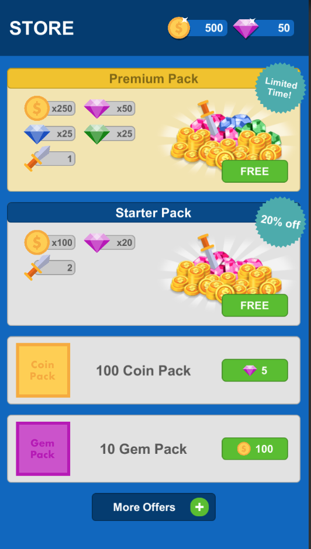

Above is one example of a layout that could be created using the provided prefabs.

While not all possible store layouts can be made using our prefabs, they provide the ability to build a lot of common layouts.
Further, the components provided can be attached to your own prefabs to do the work of accessing the Store API and processing transactions for you.

### Finding the prefab and component

The Game Foundation prefab package can be imported by going to `Window -> Game Foundation -> Import Prefabs and Samples`.
This will add a folder called `Game Foundation Prefabs` into your Assets folder.
Inside this folder you'll find all our UI Prefabs in the UI Prefabs folder, and sample scenes for how to work with them in the Samples folder.

> **Note:** The TextMesh Pro package is required for using the Game Foundation prefabs.
It is installed in new projects by default, but if you don't have it, you can use Package Manager to install it.
When you import the prefabs, if you are also prompted to import TextMesh Pro Essentials, you should do so.

The Store prefabs in particular can be found in `Game Foundation Prefabs/UI Prefabs/Store`.
You can drag any of them into your scene from there to customize.

The components that are used by these prefabs (or available to be used by your own custom prefabs) are located in the Game Foundation package inside the `Components` folder.

### Breaking down the prefabs

#### Huds


In the `Huds` folder (`Game Foundation Prefabs/UI Prefabs/Huds`) you'll find two very similar prefabs that can be used to show an image and quantity for an item.
The `Currency Hud` is for showing quantity of [Currencies], and the `Inventory Item Hud` shows the quantities of [Inventory Items].

Since Inventory Items don't have a built-in quantity concept, the component attached to this prefab displays an aggregated count of all the [Inventory Items] in the [Inventory Manager] that have the selected [Inventory Item Definition].

To see how to set up the Hud prefabs with the items you want, check out the [Hud components section].

#### Purchase Button

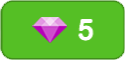

In the `Store` folder you'll find the Purchase Button prefab.
This is a relatively simple button with a very powerful component attached (see [Purchase Button component]).
In addition to the standard text field on the button, it also includes an image field for displaying an image of the item that is the cost to the [transaction].
It is used as a building block for the other store prefabs and is very adaptable to size and background image customization.

By default, the Purchase Button prefab has a persistent onClick listener that triggers the Purchase() method of the [Purchase Button component].
When the Purchase Button is clicked, the purchase of the transaction associated with it is initiated.
To customize a different behavior with the Purchase Button when it’s clicked, remove the persistent onClick listener in the Inspector, and add your preferred alternative method.

> Currently the Purchase Button prefab only supports Transactions that have one item as their cost (i.e. 10 gold is supported, but 10 gold and 2 diamonds is not).

To see how to set up the Purchase Button with the transaction you want, check out the [Purchase Button component section].

#### Transaction Items

There are four Transaction Item prefabs:
* Horizontal Transaction Item
* Vertical Transaction Item
* Columns Transaction Item
* Bundle Transaction Item

The first three transaction item prefabs (Horizontal, Vertical, and Columns) are visually similar because each contain a standard display area for an image to represent the transaction, a text field for the name of the transaction, and a Purchase Button prefab. The difference between these three transaction item prefabs is the arrangement of these three game objects:

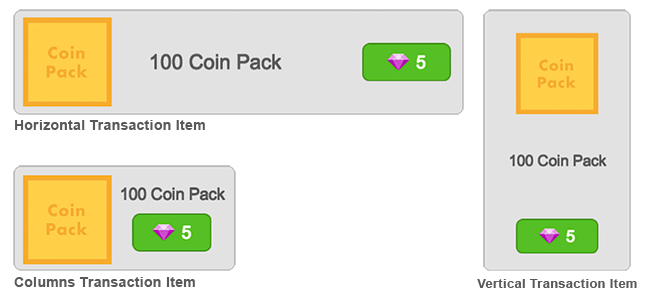

The fourth Transaction Item prefab, Bundle Transaction Item, also contains the standard display area (consisting of an image, name, and Purchase button prefab). In addition, the Bundle Transaction Item has two additional areas:

1. A section for individually displaying all of the payouts a user will receive if they purchase this transaction
2. A badge field used to call attention to the transaction

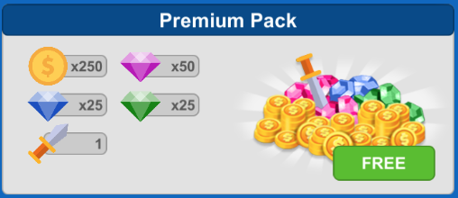

Each prefab's size, background image, and other visual features can be adjusted responsively, and can be altered to fit the look and feel of your game.

To see how to set up the Transaction Item prefabs to display the transaction you want, check out the [Transaction Item View] and [Detailed Transaction Item View] component sections.

#### Stores

There are three store prefabs.
While they don't look like much at editor time (just an empty box), at runtime they will display all the transactions in your specified store using transaction item prefabs (as pictured above).
The difference between the three store prefabs is how they lay out the transactions: either in a vertical column ideal for portrait games, a horizontal column ideal for landscape games, or a grid view which could be used in either orientation.

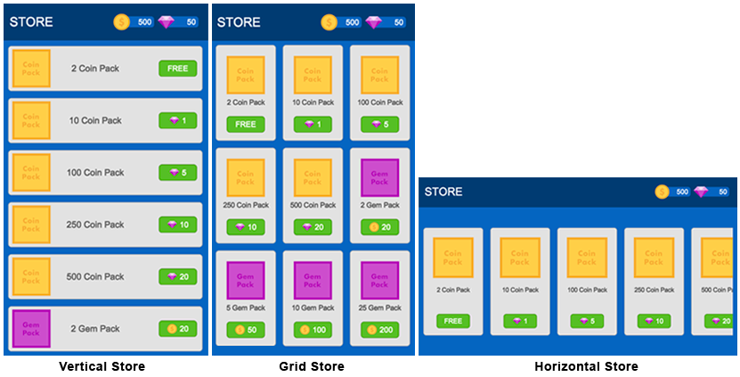

Each prefab's size, background image, and other visual features can be adjusted responsively, and can be altered to fit the look and feel of your game.

Although each store prefab comes preselected to use a transaction prefab that looks good with it, any store layout could be changed to use a different prefab using the attached [Store View component].
Note that with the Grid Store prefab, if the transaction prefab is changed, the Grid Layout Group's cell size will need to be adjusted to fit the new prefab.

> Currently the Store prefabs only support Transactions that have one item as their cost (for example, 10 gold is supported, but 10 gold and 2 diamonds is not).
> Any transactions added to the selected store that don't fit those parameters will be filtered out from the display.

To see how to set up the Store prefabs to display the store you want, check out the [Store View component section].

### Breaking down the components

#### Hud components

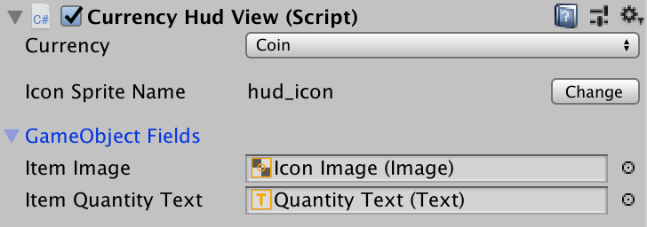

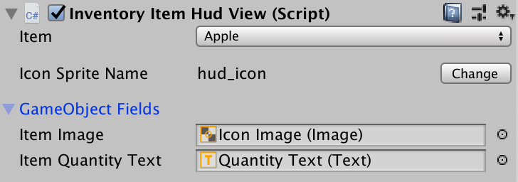

The Currency and Inventory Item View components attach to a game object with image and text game objects and handle the displaying of the items icon and quantity.

In the case of the Inventory Item View, since Inventory Items don't have a built-in quantity concept, the component displays an aggregated count of all the Inventory Items in the [Inventory Manager] that have the selected [Inventory Item Definition].

Each Hud component has the following fields.
- Currency or Item: This is the Currency or Inventory Item to display in the hud.
- Icon Asset Property Key: The name of the icon asset to display in the hud, as specified in the item's static properties (type Resources Asset).
- Item Image Field: The game object with an Image component where the item's image should be displayed.
- Item Quantity Text Field: The game object with a TestMeshProUGUI component where the item's quantity should be displayed.

#### Purchase Button component

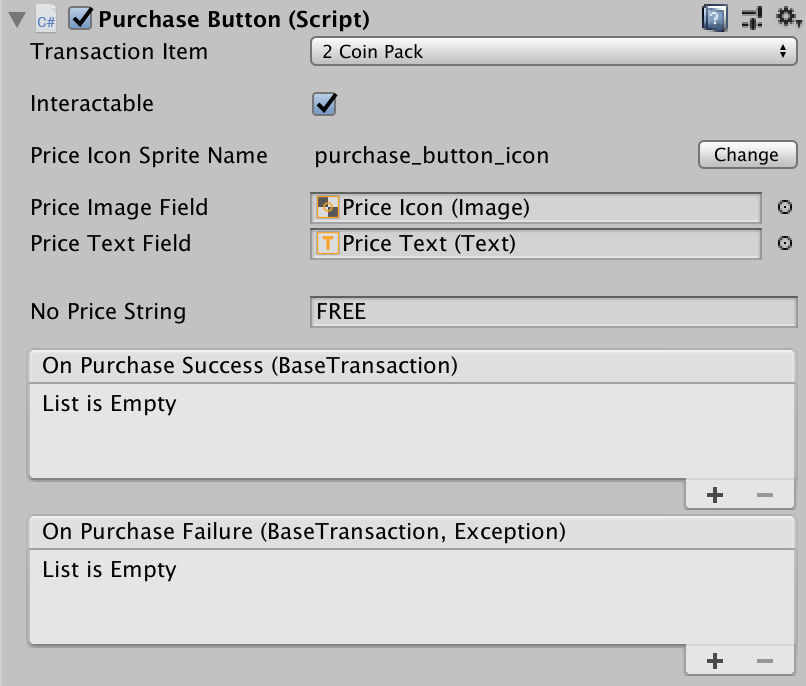

The Purchase Button component handles all the code necessary to display the cost of a transaction (either [virtual] or [IAP]), and for initiating and completing a purchase for that transaction.
It will automatically disable the button if a user doesn't have enough in their inventory or wallet to cover the cost of the transaction.

This component has the following fields that you can set from the Inspector:
- **Transaction Item**: This is the transaction the purchase button is linked to.
- **Interactable**: Boolean property that sets whether the button is interactable or not.
- **Price Icon Asset Property**: The name of the icon asset to display on the button, as specified in the static properties (type Resources Asset) of the transaction's cost item (either currency or inventory item).
- **No Price String**: The string to display if there is no cost specified for the transaction. By default, it is `FREE`.
- **Price Image Field**: The game object with an Image component where the image of the transaction's cost will be displayed.
- **Price Text Field**: The game object with a TestMeshProUGUI component where the price of the transaction will be written.
For a [virtual transaction], this is the quantity of the cost item. For an [IAP transaction], this is the real world cost of the transaction.
If there is no cost specified for the transaction, it will display the value specified in the No Price String property.
- **On Purchase Success listener**: Any method added here will be called when this button successfully completes a purchase. The method added should have a `BaseTransaction` parameter.
- **On Purchase Failure listener**: Any method added here will be called when this button fails to complete a purchase. The method added should have a `BaseTransaction` and Exception as parameters.

#### Transaction Item View component

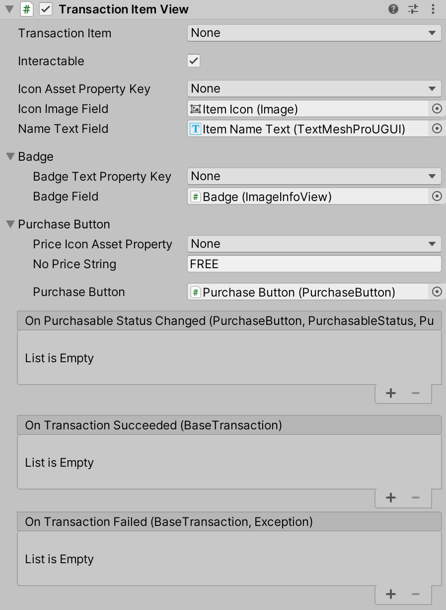

The Transaction Item View component displays relevant info about its attached transaction (either [virtual] or [IAP]).

This component has the following fields that you can set from the Inspector:
- **Transaction Item**: This is the transaction the component is linked to.
- **Interactable**: Boolean property that sets whether the specified Purchase Button is interactable or not.
- **Icon Asset Property Key**: The name of the icon asset to display on the transaction item prefab, as specified in the static properties (type Resources Asset) of the transaction.
- **Icon Image Field**: The game object with an Image component where the icon of the transaction will be displayed.
- **Name Text Field**: The game object with a TestMeshProUGUI component where the name of the transaction will be displayed.
- **Price Icon Asset Property**: The name of the icon asset to display on the purchase button prefab, as specified in the static properties (type Resources Asset) of the transaction's cost item (either currency or inventory item).
- **No Price String**: The string to display if there is no cost specified for the transaction. By default, it is `FREE`.
- **Badge Text Property Key**: (Optional) The Static Property key (type string) used to get the badge text of the transaction.
- **Badge Field**: (Optional) The text game object where the badge text (provided by the Badge Text Property Key) should be displayed.
- **Purchase Button**: The game object with a Purchase Button component attached that should be displayed. By default, it is the Game Foundation Purchase Button prefab.
- **On Transaction Succeeded listener**: Any method added here will be called when this transaction item successfully completes a purchase. The method added should have a `BaseTransaction` parameter.
- **On Transaction Failed listener**: Any method added here will be called when this transaction item fails to complete a purchase. The method added should have `BaseTransaction` and Exception as parameters.

#### Detailed Transaction Item View component

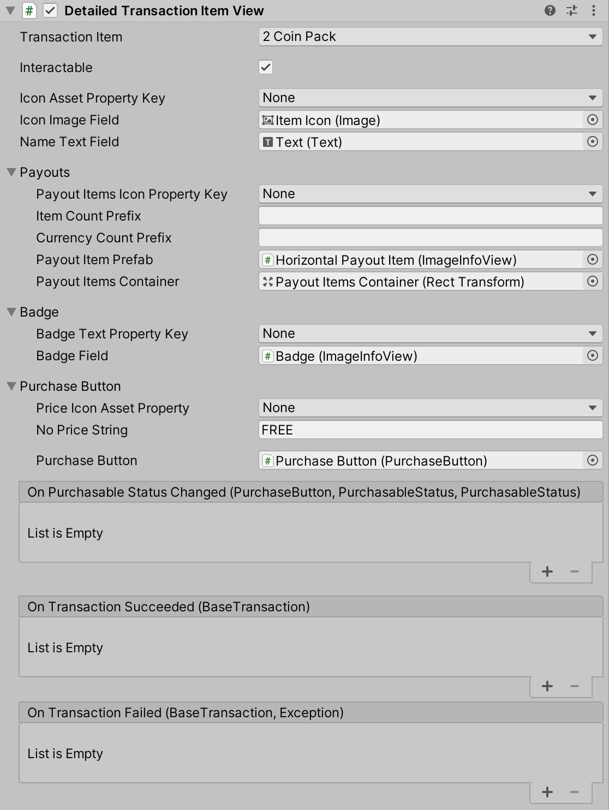


The Detailed Transaction Item View component is a child class of [Transaction Item View] and includes all of its fields, in addition to one additional section for Payouts.
The typical use case for this component will be for bundle transactions where a single transaction gives purchasers several payouts and you want to display each of those payouts individually.

In addition to the fields listed in the [Transaction Item View] section, this component also contains the following fields that you can set from the Inspector:
- **Payout Items Icon Property Key**: The Static Property key of type Resources Asset used to get the image of each payout. The same key needs to be set for each payout, otherwise the ones missing the key will not be displayed.
- **Item Count Prefix**: Specify whether you want a prefix for when the image displays the count of each item. By default an `x` is used. If the field is left blank, no prefix will be used.
- **Currency Count Prefix**: Specify whether you want a prefix for when the image displays the count of each currency. By default an `x` is used. If the field is left blank, no prefix will be used.
- **Payout Item Prefab**: Arrange the payout image and count for each transaction payout. Basic Payout Item prefabs can be found in `Game Foundation Prefabs/UI Prefabs/Store/Payout Items/`. The one used by default in the Bundle Transaction Item Prefab is the `Horizontal Payout Item`.
- **Payout Items Container**: The game object in which all of the payouts are generated.


#### Store View component

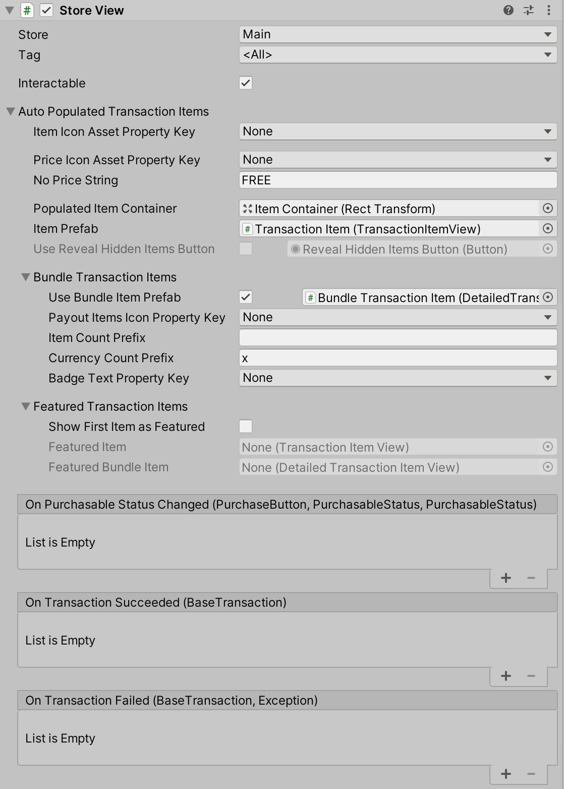

The Store View component displays all the transactions added to the selected store/tag combo.

> Currently the Store component only supports Transactions that have one item as their cost (for example, 10 gold is supported, but 10 gold and 2 diamonds is not).
> Any transactions added to the selected store that don't fit those parameters will be filtered out from the display.

This component has the following fields that you can set from the Inspector:
- **Store**: The store the component is linked to.
- **Tag**: Specify which tag to use when filtering the transactions added to the selected store. If `<All>` is selected, transactions won't be filtered.
- **Interactable**: Boolean property that sets whether each purchase button of a transaction is interactable or not.
- **Item Icon Asset Property Key**: The name of the icon asset to display on each transaction item prefab, as specified in the static properties (type Resources Asset) of the transactions.
- **Price Icon Asset Property Key**: The name of the icon asset to display on the purchase button prefab of each transaction, as specified in the static properties (type Resources Asset) of the transaction's cost item (either currency or inventory item).
- **No Price String**: The string to display if there is no cost specified for any of the transactions. By default, it is `FREE`.
- **Populated Item Container**: The game object to which all the Transaction Item prefabs will be added.
- **Item Prefab**: The game object with a Transaction Item View component attached that will be used to display the store's transactions.
- **Use Reveal Hidden Items Button**: (Optional) This selection is only available if a specific tag has been selected in the Tag field (for example, anything but `<All>` is selected).
  In that case, if the checkbox is true and a Button game object is provided, that button can be used to reveal the items in the store list that don't have the tag selected in the Tag field associated with them.
  When the button is clicked, the Store View will hide that button. 
  It is expected, though not required, that the attached button will have the `StoreView.ShowHiddenItems()` method attached to its onClick listener, and passes in true as the value.
- **Use Bundle Transaction Item**: (Optional) This combination checkbox and game object entry field allows you to choose to use a different prefab for items with more than one payout than is used for items with a single payout.
  The prefab provided must be of type Detailed Transaction Item View.
  If the game object field is blank or the checkbox is false, bundle transaction items will be shown using the default Item Prefab.
- **Payout Items Icon Property Key**: The Static Property key of type Resources Asset used to get the image of each payout. The same key needs to be set for each payout, otherwise the ones missing the key will not be displayed.
- **Item Count Prefix**: Specify whether you want a prefix for when the image displays the count of each item. By default an `x` is used. If the field is left blank, no prefix will be used.
- **Currency Count Prefix**: Specify whether you want a prefix for when the image displays the count of each currency. By default an `x` is used. If the field is left blank, no prefix will be used.
- **Badge Text Property Key**: (Optional) The Static Property key (type string) used to get the badge text of the transaction.
- **Show First Item as Featured**: (Optional) Indicates whether you want to use a special prefab for the first item in the store list.
  For example, you may want to show a special featured item at the top, with unique layout details or colors.
  Which of the following prefabs will be used depends on what type of item (single payout or bundle) is at the top of the Store list, as configured in [the Store window].
- **Featured Transaction Item Prefab**: (Optional) This is the prefab that will be used for the first item in the Store list, if the first item has only a single payout, or if the Featured Bundle Transaction Item Prefab is null.
  If this field is null, the appropriate standard transaction item prefab will be used instead.
- **Featured Bundle Transaction Item Prefab**: (Optional) This is the prefab that will be used for the first item in the Store list, if the first item has multiple payouts.
  If the first item in the Store has multiple payouts, but this field is null, the Featured Transaction Item field will be attempted to be used.
- **On Transaction Succeeded listener**: Any method added here will be called whenever any transaction in the store successfully completes a purchase. The method added should have a `BaseTransaction` parameter.
- **On Transaction Failed listener**: Any method added here will be called whenever any transaction in the store fails to complete a purchase. The method added should have `BaseTransaction` and Exception as parameters.

### Working with the components at runtime

Depending on the nature of your game, you may want to disable or change the functionality of the Purchase Button at runtime.
For example, let’s say a player with 50 gems in their wallet clicks the Purchase Button on a virtual transaction that costs 100 gems.
You may want to handle this action differently than attempting and failing to complete the transaction because the player doesn't have enough gems.

Instead, you may want to open a pop-up that allows the player to purchase a different transaction item, such as an IAP transaction, that will provide them with enough gems for their original purchase.

Here is a code sample that accounts for a case like this.

```cs
using UnityEngine;
using UnityEngine.GameFoundation.Components;
using UnityEngine.UI;

public class StoreManager : MonoBehaviour
{
    public TransactionItemView transactionView;

    void Start()
    {
        // Subscribe to any changes of the item's purchasable status
        transactionView.onPurchasableStatusChanged.AddListener(UpdateTransactionItemView);

        // Get the initial purchasable status of the button and set the button accordingly
        var purchaseButton = transactionView.purchaseButton;
        var newStatus = transactionView.purchaseButton.itemPurchasableStatus;
        var oldStatus = newStatus;

        UpdateTransactionItemView(purchaseButton, oldStatus, newStatus);
    }

    void UpdateTransactionItemView(PurchaseButton purchaseButton, PurchasableStatus oldStatus, PurchasableStatus newStatus)
    {
        if (newStatus == PurchasableStatus.ItemUnaffordable)
        {
            var button = purchaseButton.gameObject.GetComponent<Button>();
            button.onClick.AddListener(ShowItemPurchaseOptions);
        }
        else if (oldStatus == PurchasableStatus.ItemUnaffordable && newStatus == PurchasableStatus.AvailableToPurchase)
        {
            purchaseButton.gameObject.GetComponent<Button>().onClick.RemoveListener(ShowItemPurchaseOptions);
        }
    }

    void ShowItemPurchaseOptions()
    {
        // Execute logic to open a pop-up that gives the player the option to purchase an IAP transaction that will provide enough in-game currency for the cost of the original transaction.
    }
}
```

Alternatively, if an IAP Transaction based on a non consumable product has already been purchased, you may want to disable the Purchase Button so that a player doesn't attempt to purchase it again.
 
```cs
using UnityEngine;
using UnityEngine.GameFoundation.Components;

public class StoreManager : MonoBehaviour
{
    public TransactionItemView transactionView;

    void Start()
    {
        // Subscribe to any changes of the item's purchasable status
        transactionView.onPurchasableStatusChanged.AddListener(UpdateTransactionItemView);

        // Get the initial purchasable status of the button and set the button accordingly
        UpdateTransactionItemView(transactionView.purchaseButton, transactionView.purchaseButton.itemPurchasableStatus, transactionView.purchaseButton.itemPurchasableStatus);
    }

    void UpdateTransactionItemView(PurchaseButton purchaseButton, PurchasableStatus oldStatus, PurchasableStatus newStatus)
    {
        if (newStatus == PurchasableStatus.ItemOwned)
        {
            purchaseButton.interactable = false;
        }
    }
}
```

These last two examples demonstrated changing the functionality of the Purchase Button at runtime using a reference to a single TransactionItemView.

However, typically you're more likely to be working with a StoreView which holds many TransactionItemView items.
In this case, if there’s currently a purchase in progress, it’s recommended to disable all the Purchase buttons in the StoreView while a purchase occurs.

```cs
using UnityEngine;
using UnityEngine.GameFoundation.Components;
using UnityEngine.UI;

public class StoreManager : MonoBehaviour
{
    public StoreView storeView;

    void Start()
    {
        // Subscribe to any changes of the item's purchasable status
        storeView.onPurchasableStatusChanged.AddListener(UpdateStoreViewPurchaseButtons);

        // Get the initial purchasable status of the buttons and set them accordingly
        ResetAllStorePurchaseButtons();
    }

    void UpdateStoreViewPurchaseButtons(PurchaseButton purchaseButton, PurchasableStatus oldStatus, PurchasableStatus newStatus)
    {
        if (newStatus == PurchasableStatus.ItemPurchaseInProgress)
        {
            // When any button starts a purchase and gets a status of PurchaseInProgress, we want to disable all the purchase buttons in the store
            storeView.SetInteractableTransactionItems(false);
        }
        else if (oldStatus == PurchasableStatus.ItemPurchaseInProgress)
        {
            // Instead of re-enabling the transaction items using SetInteractableTransactionItems(true), check each purchase button for its current status to determine its re-enable behavior
            UpdateAllStorePurchaseButtons();
        }
    }

    void UpdateAllStorePurchaseButtons()
    {
        var purchaseButtons = storeView.GetComponentsInChildren<PurchaseButton>();

        foreach (var storePurchaseButton in purchaseButtons)
        {
            SetPurchaseButtonBehavior(storePurchaseButton, null, storePurchaseButton.itemPurchasableStatus);
        }
    }

    void SetPurchaseButtonBehavior(PurchaseButton purchaseButton, PurchasableStatus? oldStatus, PurchasableStatus newStatus)
    {
        var button = purchaseButton.gameObject.GetComponent<Button>();

        switch(newStatus)
        {
            case PurchasableStatus.ItemOwned:
                // Instead of disabling the purchaseButton when an item is owned as we did in the previous example, we could change the onClick functionality to redirect to the inventory scene
                button.onClick.RemoveAllListeners();
                button.onClick.AddListener(RedirectToInventory);
                purchaseButton.interactable = true;
                break;
            case PurchasableStatus.ItemUnaffordable:
                button.onClick.RemoveAllListeners();
                button.onClick.AddListener(ShowItemPurchaseOptions);
                purchaseButton.interactable = true;
                break;
            case PurchasableStatus.AvailableToPurchase:
                button.onClick.RemoveAllListeners();
                button.onClick.AddListener(purchaseButton.Purchase);
                purchaseButton.interactable = true;
                break;
            default:
                purchaseButton.interactable = false;
                break;
        }
    }

    void ShowItemPurchaseOptions()
    {
        // Execute logic to open a pop-up that gives the player the option to purchase an IAP transaction that will provide enough in-game currency for the cost of the original transaction.
    }

    void RedirectToInventory()
    {
        // Open inventory scene.
    }
}
```


### Conclusion

These prefabs and components should assist you when adding a simple store to your game, in addition to providing a useful starting point for any more advanced stores you may choose to create.
The [next section] of the tutorial will introduce you to another prefab we offer, which creates a pop up for advertising a special promotion, like a starter pack.


[store]: ../CatalogItems/Store.md
[currencies]: ../CatalogItems/Currency.md
[inventory items]: 02-PlayingWithRuntimeItem.md#creating-an-item-instance
[inventory manager]: ../GameSystems/InventoryManager.md
[inventory item definition]: ../CatalogItems/InventoryItemDefinition.md
[hud components section]: #hud-components
[purchase button component]: #purchase-button-component
[transaction]: ../CatalogItems/VirtualTransaction.md
[virtual]: ../CatalogItems/VirtualTransaction.md
[iap]: ../CatalogItems/IAPTransaction.md
[purchase button component section]: #purchase-button-component
[store view component]: #store-view-component
[store view component section]: #store-view-component
[currencies]: ../CatalogItems/Currency.md
[virtual transaction]: ../CatalogItems/VirtualTransaction.md
[iap transaction]: ../CatalogItems/IAPTransaction.md
[next section]: 14-WorkingWithPromotionPopupPrefab.md
[Transaction Item View]: #transaction-item-view-component
[Detailed Transaction Item View]: #detailed-transaction-item-view-component
[the Store window]: 12-FilterTransactionWithStore.md#the-store-window
