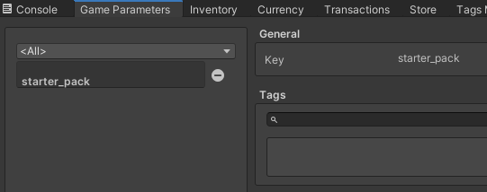
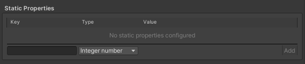
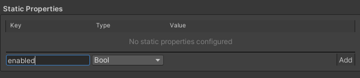
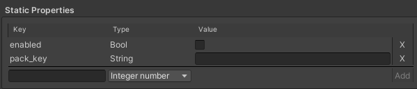

# Game Foundation Tutorials

## Configure your game with parameters

Game data isn't just item properties, [currencies] or [transactions].
It is also a set of global configurations that may not concern the player inventory or wallet:

- for a given level:
  - the time you have to finish a level
  - its default difficulty
  - the minimum score you need to reach one, two, or three stars
  - the amount of soft currency you get when you finish it
- the default difficulty of the game
- a switch to display the starter pack or not for new players
- the default name of the main character
- ...

Those requirements are not related to anything Game Foundation manages at the moment, but yet, you still need to store those values somewhere.


## The Game Parameter window


Game Paramter is very similar to other Game Foundation catalog item editors.
As a [Game Parameter] is essentially another type of [catalog item] but at global level, the way you'll create a Game Parameter is similar to other item definitions we've shown you in the tutorials already.

## Creating a Game Parameter

For this tutorial, we'll make something really simple.
We'll get the Starter Pack example from above.
We'll create a Game Parameter object to define two parameters:

- Do we want to see the Starter Pack flow or not
- In case we want to see it, which pack do we want to display

Click on the "+" button on the bottom left corner in order to create a new entry, and call it `starter_pack`, and click on the Create button add finish creating it.



Then we'll add two fields to define some paramters under this definition, under the Static Properties section: 



*(Note that currently that only static properties are available for Game Parameter definitions)*
  
Let's create a `boolean` property called `enabled`.
It will be used as a switch to enable/disable the starter pack feature.
Set it to `true`.



Then create a `string` property called `pack_key`.
We'll store the `key` field from the transaction definition to help us decide which one we'll use as the content for the starter pack.



Enter the key of an [IAP transaction] available in your catalog.

## Getting the game parameter at runtime

Retrieving the game parameters is just like retrieving any catalog item.
It all comes from `GameFoundationSdk.catalog`.

The snippet you'd use would look like the following:

```cs
// Gets the game parameter from its key
GameParameter starterPack = GameFoundationSdk.catalog.Find<GameParameter>("starter_pack");

bool enabled = starterPack["enabled"];
if (enabled)
{
    // Gets the pack from its key.
    string packKey = starterPack["pack_key"];
    BaseTransaction pack = GameFoundationSdk.catalog.Find<BaseTransaction>(packKey);

    // Here we'll put the code to display the pack and show
    // a button to sell it to the user.
}
``` 

### Conclusion

Now that you've learned about expanding your game functionality with Game Parameters, the [next section] can help expand your game's retention by showing you how to use the Rewards system.


[currency]:   ../CatalogItems/Currency.md
[currencies]: ../CatalogItems/Currency.md

[catalog item]: ../Catalog.md#catalog-items

[transactions]:    ../CatalogItems/IAPTransaction.md
[iap transaction]: ../CatalogItems/IAPTransaction.md

[game parameter]: ../CatalogItems/GameParameters.md
[next section]: 17-CreatingRewards.md