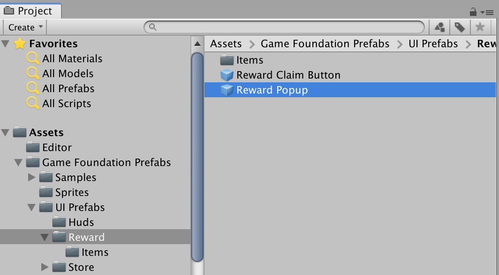
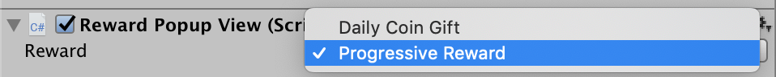
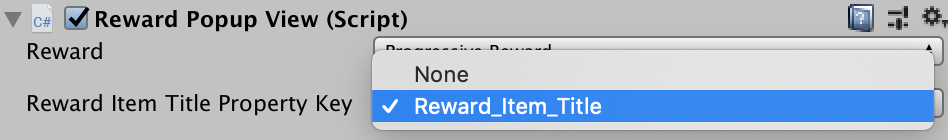
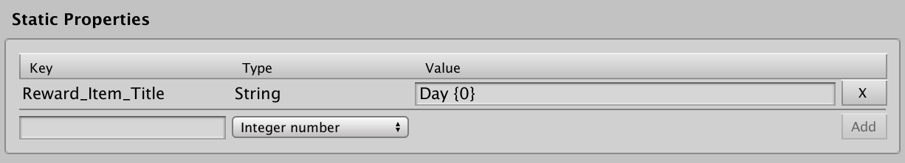
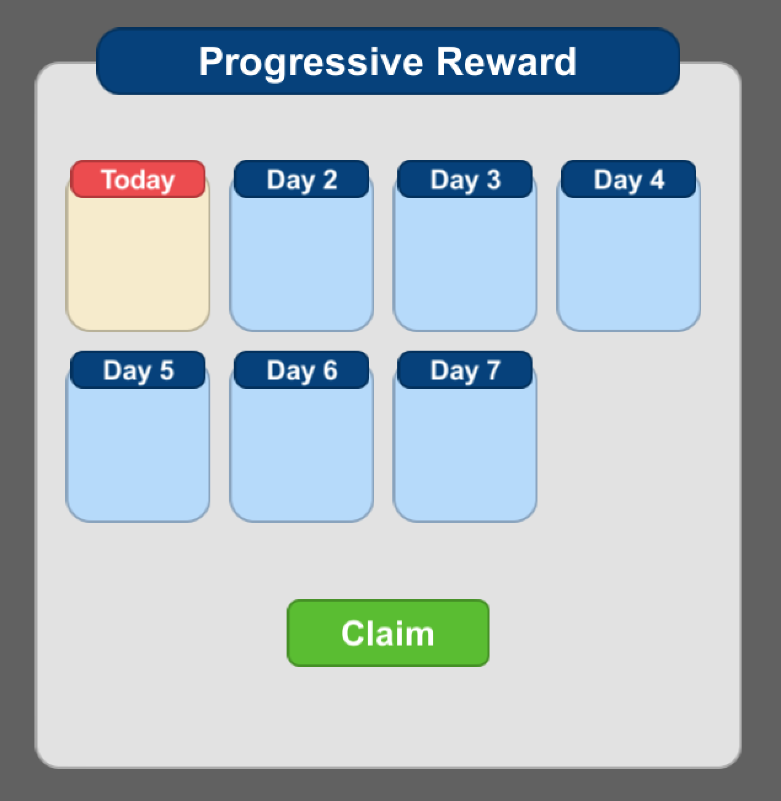
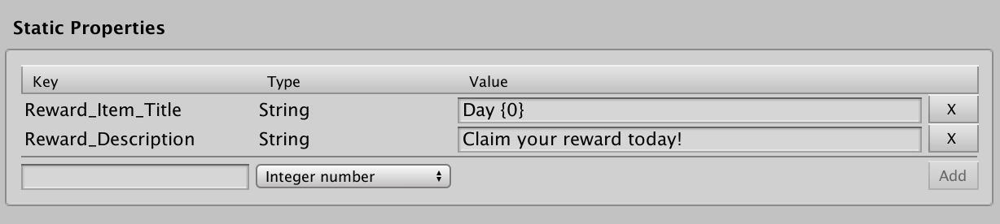
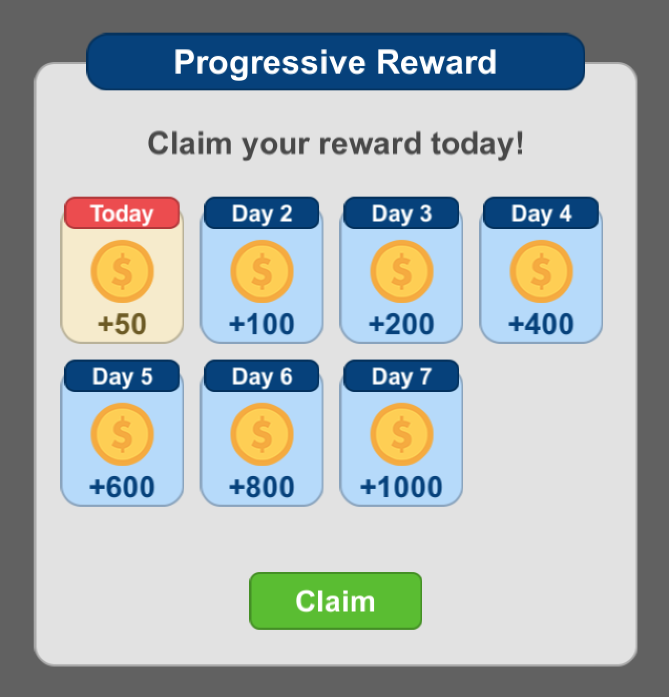

# Game Foundation Tutorials

## Setting up a reward in game using Reward prefab

Once you've set up [Reward Definitions] by creating a simple daily reward or progressive reward in your game in the [previous tutorial], you're ready to try them out at runtime to see how rewards appear in your game.
The easiest way to do this is using the Reward Prefab included in the Game Foundation Prefabs package.

### Finding the Game Foundation Reward prefab

If you haven't already imported the Game Foundation Prefabs package, go to `Window > Game Foundation > Import Prefabs and Samples`.
After importing the Game Foundation Prefabs package, a folder called `Game Foundation Prefabs` will be added to your Assets folder.
Inside the Game Foundation Prefabs folder is a folder called `UI Prefabs`, which contains all the UI prefabs, and a folder called `Samples`, which contains sample scenes to help you learn how to work with the UI prefabs.

The prefab that will let you try out your progressive reward at runtime is the `Progressive Reward Popup` prefab located in `Game Foundation Prefabs > UI Prefabs > Reward`.
To get started, drag the Progressive Reward Popup prefab into your scene.
Alternatively, you can click "Open Prefab" in the inspector to change all instances of the Progressive Reward Popup.

### Configuring the Reward prefab

To configure the Reward prefab to display the information you want:

- First select which Reward you want to display in this Game Object.
The Reward drop down will show all Rewards that have been created in the Reward editor window.
You should see the two Rewards created in the [previous tutorial].

> Note that currently the Reward Prefab only supports Rewards where there is a single payout (either Currency or Inventory Item) per Reward Item.

- Next select the correct Reward Item Title Property Key.
The selected key corresponds to a Static Property on the Reward, the value of which dictates the string used in the title area of each Reward Item.
If you do not want a title displayed for each Reward Item, you can disable the Item Title Game Object in each of the 4 Reward Item prefabs.

> If the dropdown says only None, and you want a title displayed, you will need to add a Static Property of type string to the Reward.
If you supply a format string (where the string includes a `'{0}'` as part of it) the RewardPopupView component will substitute that part of the string with the number of the given Reward Item (see images).

- Next select the Payout Item Icon Property Key.
This is the Static Property key attached to each Currency or Inventory Item that may be paid out as part of the Reward.
It is used to display images for what the player will get for each reward claim.

- Finally, if you would like to display a description for your Reward you can add a Static Property of type string to the Reward, and select the key in the Description Property Key dropdown on the RewardPopupView component.

At this point your Reward should look something like

You can further customize your Reward by:
- changing the Reward Item prefabs that are associated with the 4 Reward Item states
- changing the Cooldown and Expiration description texts
- changing the display format of the countdown timer
- changing any number of UI/UX aspects of the Game Objects themselves, like size, shape, background color, etc.

## Conclusion
Hopefully this Reward prefab will give you a quick and flexible way to get up and running with Rewards in your game.
However, should you for any reason want to forgo the Reward prefab and work directly with the Reward System yourself, the [next tutorial] will walk you through how to do that.

[Reward Definitions]: ../CatalogItems/RewardDefinition.md
[previous tutorial]: 17-CreatingRewards.md
[next tutorial]: 18-GettingAndClaimingRewardsRuntime.md
